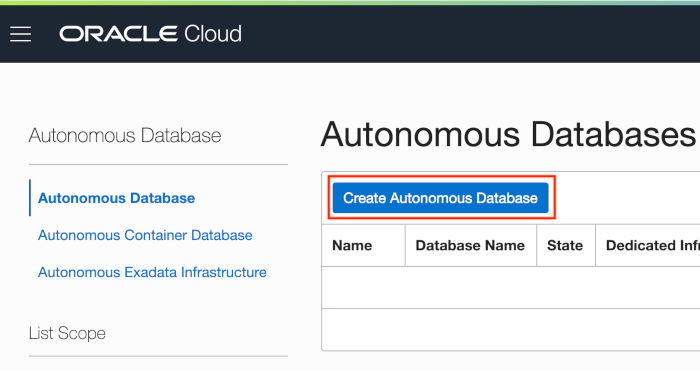
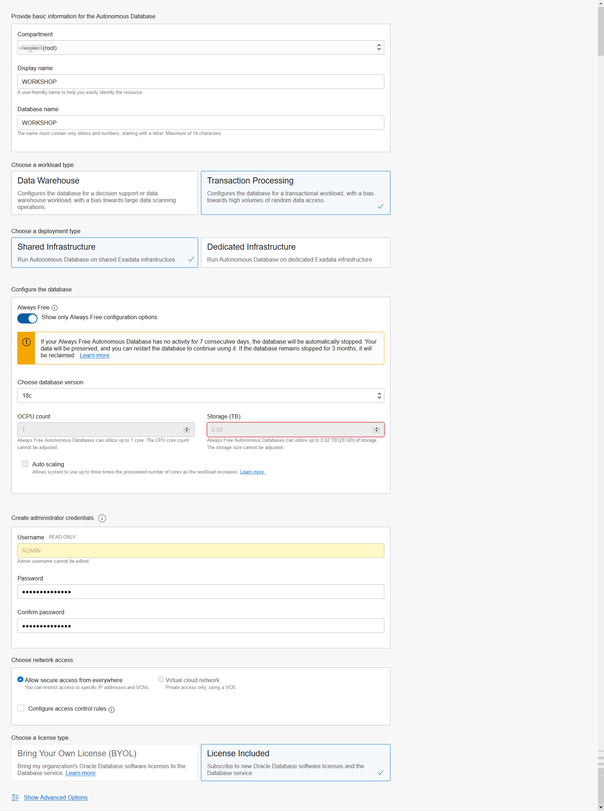
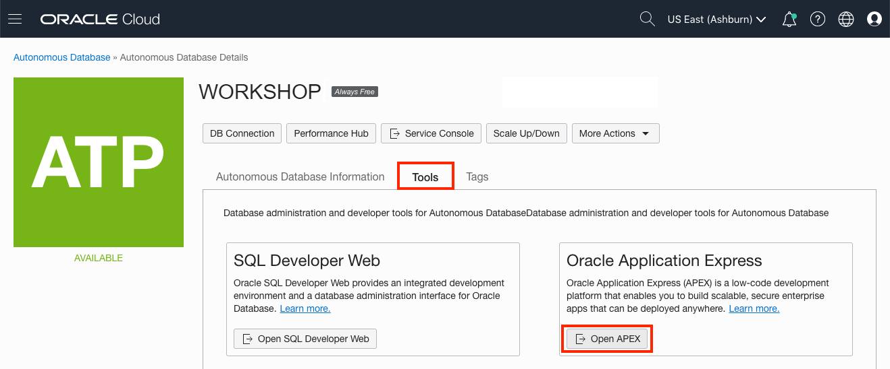
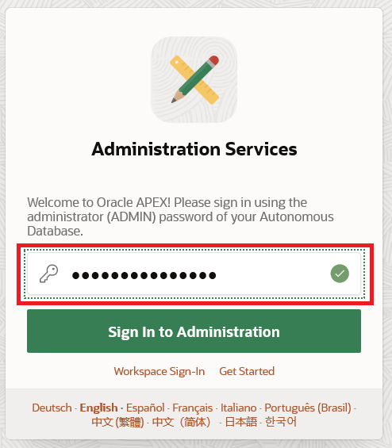
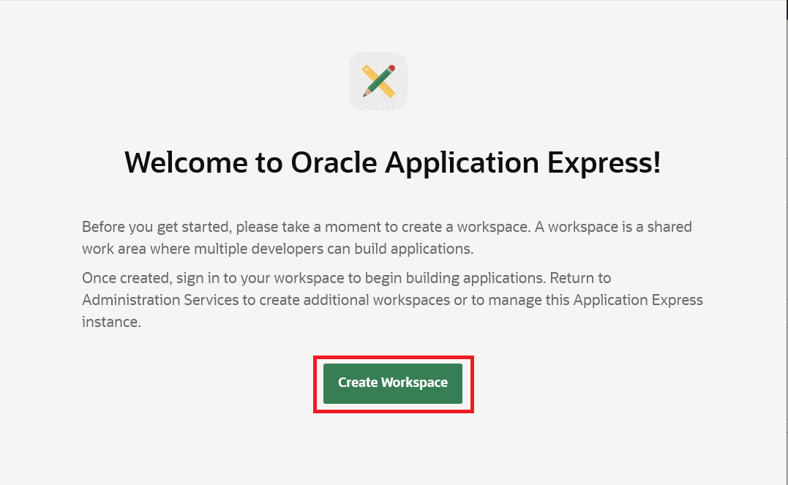
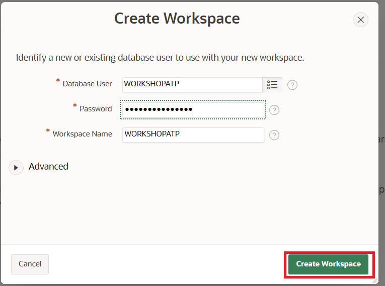
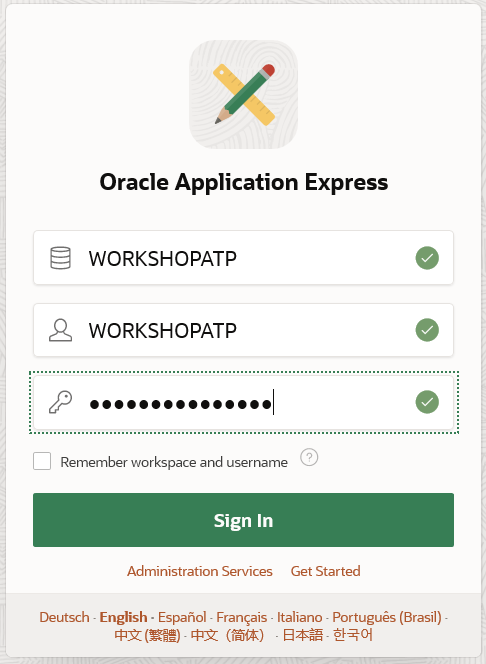

# Create an APEX Workspace on a Oracle Autonomous Transaction Processing Instance

## Introduction

Oracle Application Express (APEX) is a feature of Oracle Database, including the Autonomous Data Warehouse (ADW) and Autonomous Transaction Processing (ATP) services. To start, you will need to create an ATP instance and then access APEX from within the new database.

An APEX Workspace is a logical domain where you define APEX applications. Each workspace is associated with one or more database schemas (database users) which are used to store the database objects, such as tables, views, packages, and more. These database objects are generally what APEX applications are built on top of.

### Objectives
- Create an Oracle Autonomous Transaction Processing instance (ATP)
- Create an APEX Workspace on your ATP instance

### What Do You Need?

* An Oracle Cloud paid account or free trial. To sign up for a trial account with $300 in credits for 30 days, click [here](http://oracle.com/cloud/free).

### Estimated Time: 15 minutes

## **STEP 1**: Provision an Autonomous Transaction Processing instance

From within your Oracle Cloud environment, you will create an instance of the Autonomous Transaction Processing database service.

1. From the Cloud Dashboard, select the navigation menu icon in the upper left-hand corner and then select **Autonomous Transaction Processing**.

    

2. Click **Create Autonomous Database**.

    

3. Do the following:
    - Enter **WORKSHOP** as the Display AND Database name
    - Select **Transaction Processing** as the workload type and **Serverless** as the deployment type
    - Select the **Always Free** option
    - Enter **`SecretPassw0rd`** for the ADMIN password, then click **Create Autonomous Database**.

    
    
    

4. After clicking **Create Autonomous Database**, you will be redirected to the Autonomous Database Details page for the new instance.

    Continue when the status changes from:

    

    to:

    

## **STEP 2**: Create your APEX Workspace
Within your new database, APEX is not yet configured. Therefore, when you first access APEX you will need to log in as an APEX Instance Administrator to create a workspace.

1. Click the **Tools** then click **Open APEX**.

    

2. Enter the password for the Administration Services and click **Sign In to Administration**.     
    The password is the same as the one entered for the ADMIN user when creating the ATP instance: **```SecretPassw0rd```**

    

3. Click **Create Workspace**.

    

4. In the Create Workspace dialog, enter the following:

    | Property | Value |
    | --- | --- |
    | Database User | WORKSHOPATP |
    | Password | **`SecretPassw0rd`** |
    | Workspace Name | WORKSHOPATP |

    Click **Create Workspace**.

    

5. In the APEX Instance Administration page, click the **WORKSHOPATP** link in the success message.         
    *{Note: This will log you out of APEX Administration so that you can log into your new workspace.}*

    

6. On the APEX Workspace log in page, enter **``SecretPassw0rd``** for the password, check the **Remember workspace and username** checkbox, and then click **Sign In**.

    

This completes the lab setup. At this point, you know how to create an APEX Workspace and you are ready to start building amazing apps, fast.

## Acknowledgements
* **Author** - Juan Cabrera Eisman, Senior Technology Solution Engineer, Oracle Digital
* **Last Updated By/Date** - Tom McGinn, Learning Architect, Database User Assistance, May 2020

See an issue?  Please open up a request [here](https://github.com/oracle/learning-library/issues).   Please include the workshop name and lab in your request.
