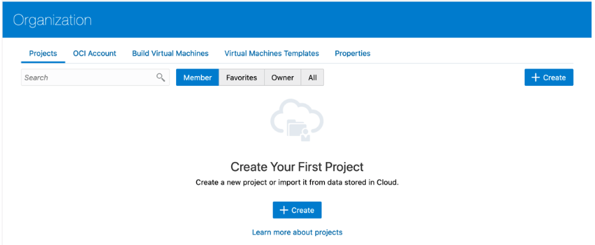

[Go to ATP Overview Page](../../ATP/readme.md)


# Microservices on ATP #

## Setting up your Visual Builder Studio Project ##


## Introduction ##

In this lab, you’ll learn how to set up a new Visual Builder Studio project, based on a Github repository, and start modifying and automating the CI/CD steps for your environment.

You will work with Visual Builder Studio and learn about some of its most important features.  

Let’s get started! 

## Steps

### Step 1: Create a project environment for your team

In this section, you’ll provision a complete development platform for your team by leveraging the Visual Builder Studio web interface.

- Access your Visual Builder Studio Instance : use the URL to your Visual Builder Studio Console you saved during the setup of your environment (Remark: if you are using the Oracle CTD tenancy, see your access document for the URL)
- On the Welcome page, click **+ Create**.




- Give your project a name that begins with your own name, such as **JohnDunbarATPLab**, to make your project unique.  Then: 

  - Enter a **Description**, such as **ATP Lab Project**.

  - Leave the Security setting specified as **Private**.

  - Click **Next**

    
    
    

- Click **Empty Project**, then click **Next**.

  

  

- Select your preferred wiki markup language, then click **Finish**

  

  

- Wait while the project modules are provisioned, which can take a minute or two. You can see the indicators turn green as the associated modules are provisioned.

  

  

- When everything is provisioned, the project Home page opens, which contains details about your newly created project:

  

  
  
  Let’s take a look at this page (you may need to scroll to see the whole thing): 
  - On the left side is an activity feed. 
  
  - Tabs on the right side show you where the Git source code and Maven repositories are located.
  
  - Also on the right you can see project statistics, as well as the UI where you can manage team members.  Let’s take a look at that UI now. 
  
    


### Step 2:  Fetch and review code from the Git repository

- With the **Project Home** selected on the left menu, look to the right and select **Repositories**, then click **+ Create** button.

  

- In the New Repository dialog, enter these details: 
  - Type **ATPDocker** in the **Name** field.  In case you are sharing a repository with other participants, add your initials at the end of the name, like for example **ATPDocker_JLE**

  - Type **Microservices and ATP** in the **Description** field

  - Choose **Import Existing Repository** under **Initial content**

  - Enter https://github.com/CloudTestDrive/ATPDocker.git in the text box: 

    

- Click **Create**.

  You should now be on the **Git** tab, which shows that you have a new git repository.  This new repository contains imported code from the GitHub repository you specified.

  


### Cloning your repository locally

We want to upload some larger files (e.g. libraries) to the Visual Builder Studio git Repository.  The easiest way to do this consists of making a local branch of the repository on your machine.  For this lab, to avoid having to install software on your local machine (git, kubectl, terraform), we will be using the **Oracle Cloud Shell**, a Linux environment that is part of your **Oracle Cloud Console** in the browser.

To open the **Cloud Shell**, use the button **">_"** in the upper right of the console.

- In the home directory, create a directory where you will clone the repository, and move into this directory:

```
mkdir dev

cd dev
```


- Copy the URL of your newly created repository in Visual Builder Studio, by navigating to the "Project Home" page on the left, then selecting the **Clone** button of your repository on the right.  Select **Clone with HTTPS** and the URL will be copied.


Now you can enter a command similar to the one below to clone your repository

- Type in the command **git clone** followed by a space
- paste the URL you just copied into the terminal

The result should look like:

`git clone https://<user_name>@ctddevcs-<instance_name>.developer.ocp.oraclecloud.com/ctddevcs-<instance_name>/s/ctddevcs-<instance_name>_atpdocker_1741/scm/ATPDocker.git`

You will be asked for the password of the user you used to login to the Visual Builder Studio environment.

This will result in following output:


You are now ready to start configuring your CI/CD flows in this project!

- create the necessary database objects
- build your application Docker Container
- deploy the container to a Kubernetes cluster

---

Use the **Back Button** of your browser to go back to the overview page and select the next lab step to continue.