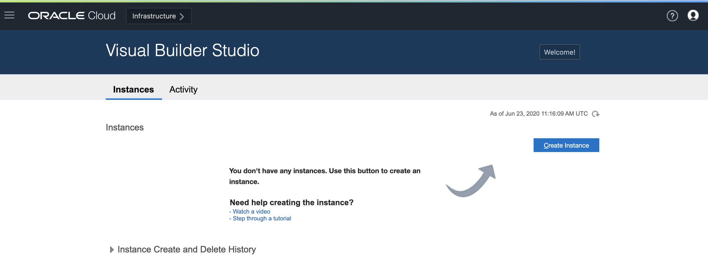
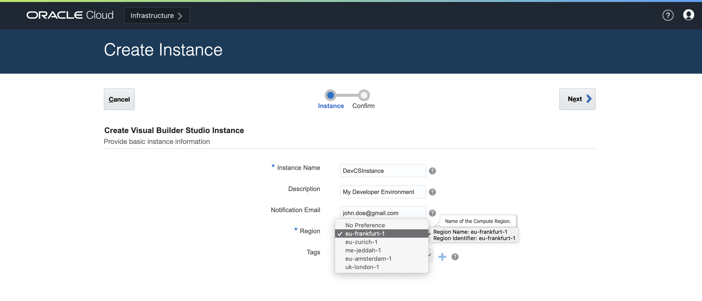
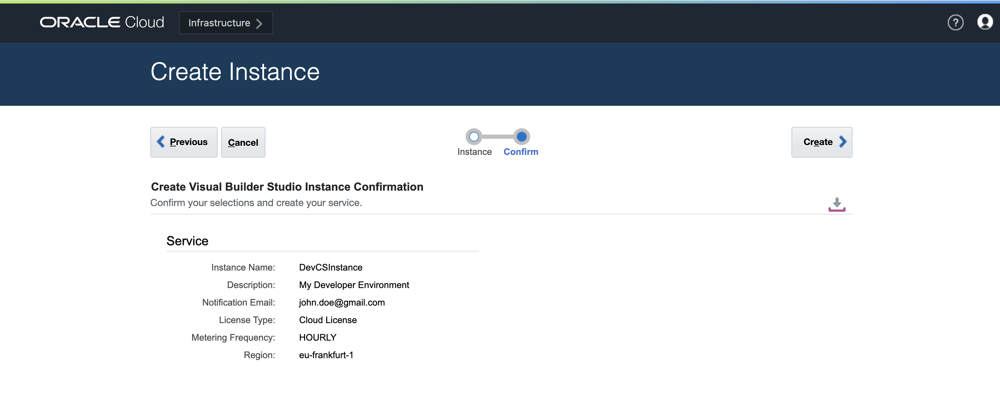
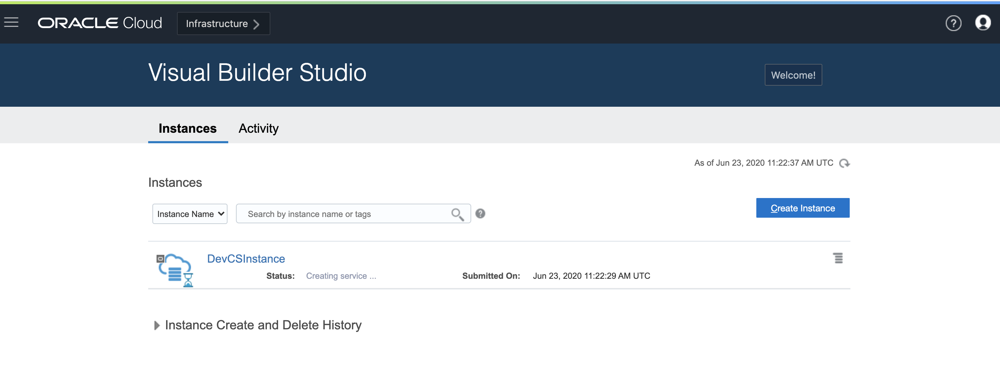
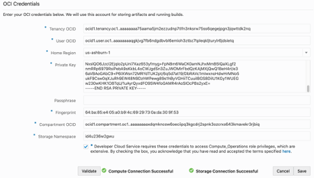
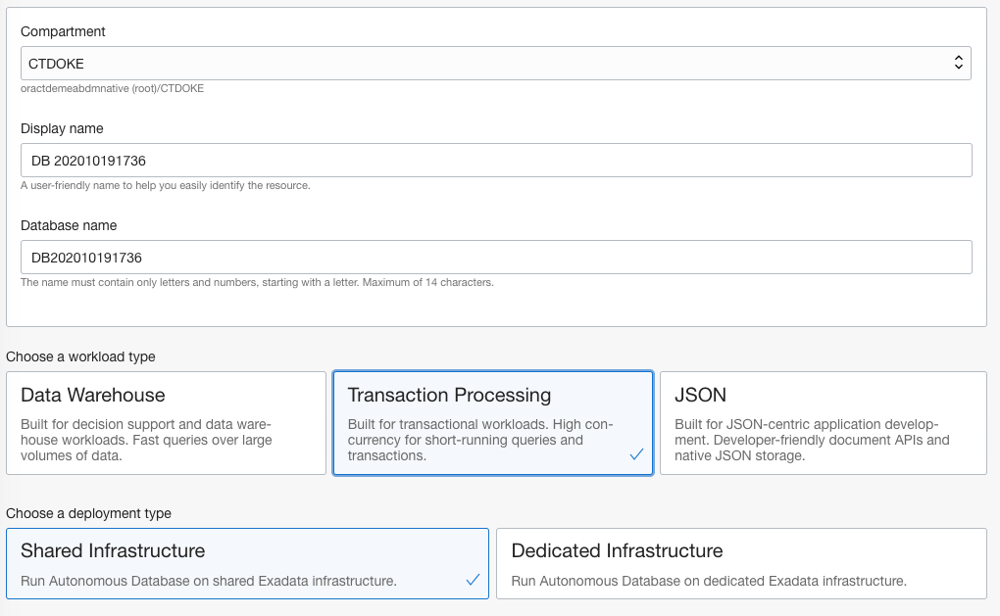

# Microservices on ATP #
## Preparing your Oracle Cloud Tenancy for the lab ##

## Introduction ##

In case you are using a personal instance, either obtained via the Oracle Cloud Free Tier or using an existing paying account, you need to ensure the basic services for this lab are up and running, and ensure your user has the right entitlements to execute this lab successfully.

This page will guide you through the following activities :

- Step 1: Create a compartment called CTDOKE which we will use in this lab
- Step 2: Add a certificate and a token to your user
- Step 3 : Create an Instance of Visual Builder Studio Service
- Step 4 : Configure the new Visual Builder Studio instance
- Step 5 : Create a new Autonomous Database instance


**ATTENTION** : if you are running this lab in a **Instructor-provided environment**, most of this setup has already been done, **you can skip the steps on this page**.  A link to the instance will be provided by your instructor.


## Step 1: Create a compartment called CTDOKE

### Log in to your cloud account

In this lab you will be using the PaaS services that are linked with the **Identity Management Service** called IDCS.  In order to be able to manage these services you need to login using the option shown below:

 

Once you are logged in you will find yourself on the Oracle Cloud Infrastructure console page as shown below:


### Creating a Compartment

- Click on the hamburger menu on the top left of the screen. From the pull-out menu, scroll down to the **Identity** section, and click **Compartments**.


- You will see the list of compartments currently available in your instance, which will include at least the root compartment of your tenancy (with has the tenancy name). 
  - 
- Click on **Create Compartment** button to start the compartment creation process


Enter the following in create Compartment window

- **Name**: Enter **CTDOKE**
- **Description**: Enter a description for the compartment
- **Parent Compartment**:  select the root compartment.
- Click on the **Create Compartment** link 
- You can verify the compartment created on Compartments page


After you successfully created the compartment, note down the **Compartment OCID**, you will need it later in the lab :


## STEP 2: Create a user certificate and token

In order to interact with the various Cloud Services in a secure way, we will be using a **password token** and a **API Key**.

### Locate your User Details

First you need to locate your user using the Search functionality of the console:

- Click on the **Search Bar** on the top of your console, and enter your username.  For example, if your name was **ppan** : 

  

- Select the user **that looks like :  oracleidentitycloudservice/(your_name)**

### Create a Token


- Select **Token** in the right-hand menu, then click the button **Create Token**.

  - Enter a name for the token

  - Use the **Copy** button to copy the token in your buffer, and **immediately paste it** in a notebook of your choice, you will need this later.

    


### Create an API Key

- Add an API key:

  - In the left-hand menu, click on the **API Keys** menu

  - Add an API key: you need a private/public key pair, and you need to paste the public one into the key field. 
  
    - An **Example** is proveded below: both private and public keys are made available, so obviously this is **not good security practice**.
  
      - [Public key](keys/api_key_public.pem)
      - [Private key](keys/api_key.pem)
  
    - **Good practice** is to generate your own keys: You can use the following [OpenSSL](http://www.openssl.org/) commands to generate the key pair in the required PEM format. You can use the Oracle Cloud Shell to issue these commands: use the "**>_**" icon in the top right of your console.
  
      - Open a Cloud Shell and execute following commands
  
        - ```
          mkdir ./mykey
          openssl genrsa -out ./mykey/api_key.pem 2048
          openssl rsa -pubout -in ./mykey/api_key.pem -out ./mykey/api_key_public.pem
          ```
        
      - For more details on this key creation, see the [documentation](https://docs.cloud.oracle.com/iaas/Content/API/Concepts/apisigningkey.htm).
  
  - Once you have the key pair available, return to the detailed screen of your user
  
    - Click on the **Add Public Key** button
    - Either select the local file containing the public key, or paste the content of the file into the "Public Key" field.
    - Click **Add** to create the key
  
  - Copy the fingerprint of your API key in a temporary file
  
  - Copy the OCID of this user in a temporary file
  
  


## Step 3 : Setting up Visual Builder Studio

This step will guide you through the setup of a new Visual Builder Studio instance:

- Navigate to your PaaS services Dashboard
- Create a Visual Builder Studio instance
- Configuring the Storage and Build parameters for your Visual Builder Studio instance

Note : The *Visual Builder Studio* service was previously named *Developer Cloud Service*, but all the key screens have remained unchanged.


### Navigate to the Visual Builder Studio Service page ###

- Login to your cloud account using the SSO login screen of the **oracleidentitycloudservice**.  See the very beginning of this lab for details.
- Locate the **Platform Services** menu and select **Developer**


### Create an instance ###

-  You should have no existing instances.  If you have, you can skip the following steps and just validate you have a build engine witht the correct libraries included.




- Use the "Create Instance" button to create a new Visual Builder Studio instance



Note: You should match the region selected with your home region.


- Hit the "Next" button and then "Create"




- Now the instance is being created.  This will take a few minutes, you can hit the small arrow to requery the status.




### Access your Visual Builder Studio Environment ###

To access your Visual Builder Studio Instance, refresh the page and use the hamburger menu on the right to access the menu item **Access Service Instance**. 

Be sure to **bookmark** this link for future use.


## Step 4 : Configure Visual Builder Studio

To configure Visual Builder Studio to use the OCI Compute resources for its build engines, we need to manually provide the OCI credentials in the setup menu.

**Attention !!** 

In the following section you will need to switch repeatedly between the Visual Builder Studio console (on the left in the below screenshot) and the OCI Cloud Interface,  where you need to collect a number of parameters of your instance (on the right in the below screenshot)

**Take a minute to set up 2 browser windows that allow easy switching between these 2 screens** to cut and paste parameters between them ! 


### Configure the OCI Account

- In Visual Builder Studio, on the left-side menu, select the top level **Organization** menu, then click on **OCI Account** in the top menu.  Next you can hit the **Connect** button.


- The OCI credentials can be found in your main cloud dasboard / Administration / Tenancy details


- The user details can be found in your main cloud dasboard / Identity/ Users / click on api.user


- You should have noted the OCID of the **CTDOKE** Compartment earlier in this section just after the creation.

- The **Home Region** can be found by simply selecting the name of your region in the top menu bar, and clicking on **Manage Regions**

  

  

  - On the resulting screen you can see the **Region Identifier**, in this example ***eu-frankfurt-1***

    


- Now that you have collected all the required data, you can fill in your OCI Credentials screen in the Visual Builder Studio Console : 

  


### Create a Virtual Machine

- On the left-side menu, select the top level **Organization** menu, then click on **Virtual Machines Templates** in the top menu.  Next you can hit the **Create Template** button.


- In the dialog box, specify a name, for example **OKE2**  and use the default **Oracle Linux 7** image.  Then hit the **Create** button.

  


- Now select the template you just created (OKE2), and add the required software packages by clicking on the **Configure Software** button.


- Select the following packages:
  - Docker 17.12
  - Kubectl
  - OCIcli ==> this will prompt you to also install Python3
  - SQLcl 18


- Finally, navigate to the **Build Virtual Machines** menu on the top menu, and hit the **+ Create VM** button.

  

  
  
  In the dialog that pops up, enter following values:
  
  - Choose **Quantity = 1**
  
  - Select the **VM Template** you just created: **OKE2**
  
  - Set the **Region** to **eu-Frankfurt-1**
  
  - Select the compute **Shape** : **VM.Standard2.1**
  
    


## Step 5 : Provisioning an Autonomous Transaction Processing Database


#### **Introduction**

This lab walks you through the steps to get started using the Oracle Autonomous Transaction Processing Database on Oracle Cloud Infrastructure (OCI). You will provision a new database, and connect to it using SQL Developer

### **Create an ATP Instance**

-  Click on the hamburger menu icon on the top left of the screen


-  Click on **Autonomous Transaction Processing** from the menu


- Select the compartment you created previously 
- Click on **Create Autonomous Database** button to start the instance creation process


-  This will bring up Create Autonomous Database screen where you specify the configurations of the instance
   -  Verify your compartment is selected
   -  Specify a name for the instance, for example containing your initials for easy reference
   -  Select **Transaction Processing**
   -  Select **Shared Infrastructure**




- Select a OCPU Count of 1
- Select 1 TB of storage
- Specify the password for the instance, for example : 

```
WElcome_123#
```


- Choose a license type: You will see 2 options.   
  - **Bring Your Own License (BYOL)** :  Oracle allows you to bring your unused on-prem licenses to the cloud and your instances are billed at a discounted rate. This is the default option so ensure you have the right license type for this subscription.
  - If you do not have available on-premise Licenses, select the option **License Included**, in this case License fees will be included in the hourly rate of your database.


- Click on **Create Autonomous Database** to start provisioning the instance


- Once you create ATP Database it would take 2-3 minutes for the instance to be provisioned.


-  Once it finishes provisioning, you can click on the instance name to see details of it


You now have created your first Autonomous Transaction Processing Cloud instance.


### Connect to the ATP instance with SQL Developer** Web

Lets connect to the database you just created using the build-in **SQL Developer Web** tool.

- Navigate to your OCI console, and select the ATP database you are using

  

  

- On the Database Details page, navigate to the **Service Console**, 

  

  

- Then select **Development** in the left-hand menu, and then the tile labeled **SQL Developer Web** 

  

- You can now visualize the tables in the database, and execute queries.  Of course this is an empty database for now, we will reuse this tool later to check you have deployed objects into the database via Visual Builder Studio

---


You finished all the steps of the Visual Builder Studio setup.   Use the menu to navigate to the next chapter.

