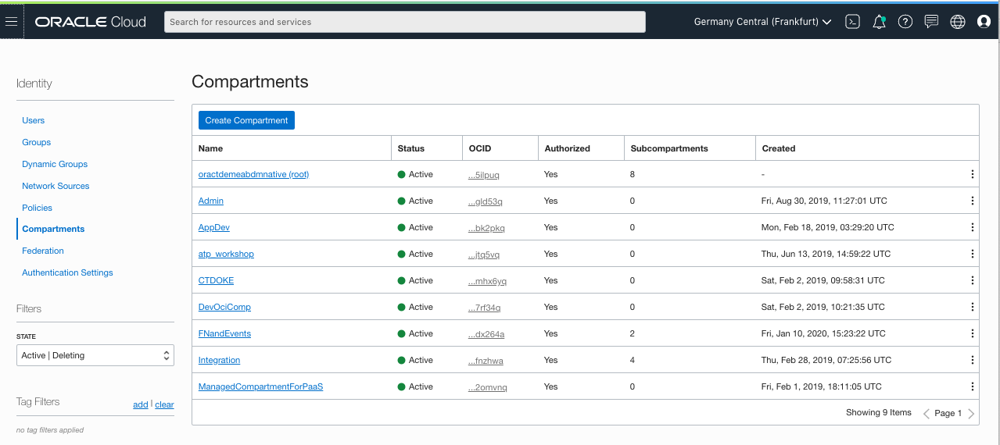

[Go to Overview Page](../README.md)


# Migration of Monolith to Cloud Native

<details><summary><b>Self guided student - video introduction</b></summary>


This video is an introduction to the Kubernetes labs setup - for people who have not done the Helidon and docker sections. Once you've watched it please press the "Back" button on your browser to return to the labs.

[](https://youtu.be/o3KqqMqRxPk "Kubernetes labs only setup introduction video")

---

</details>

## Introduction

This page explains the steps to set up your **Oracle Cloud Tenancy** so you are ready to run the **C. Helidon lab**. 

If you have completed the Helidon labs then you will have already setup the compartment and ATP database, so you can return to the main lab.

**If you are attending an instructor-led lab**, your instructor will detail steps you need to execute and which ones you can skip.

## 1. Create the CTDOKE compartment

- Click the `hamburger` menu (three bars on the upper left)

- Scroll down the list to the `Governance and Administration` section

- Under the `Identity` option chose `Compartments`

- You should see a screen that looks like this : 

  

  

- **ATTENTION** : if the compartment **CTDOKE** already exists, please move to the next item on this page
- If the **CTDOKE** compartment is not yet there, **create it** : 
  - Click the `Create Compartment` button
  - Provide a name, description
  - Chose **root** as the parent compartment
  - Click the `Create Compartment` button.


## 2. Setup the database

### 2a. Create the database

- Use the Hamburger menu, and select the Database section, **Autonomous Transaction Processing**
- Click **Create DB**

- Make sure the **CTDOKE** compartment is selected
- Fill in the form, and make sure to give the DB a unique name for you in case multiple users are running the lab on this tenancy.

- Make the workload type `Transaction Processing` 
- Set the deployment type `Shared Infrastructure` 

- Chose the most recent option for the database version, allocate 1 OCPU and 1 GB of storage (this lab only requires a very small database)

- Turn off auto scaling

- Make sure that the `Allow secure access from everywhere` is enabled.

- Chose the `License included` option

Be sure to remember the **admin password**, save it in a notes document for later reference.

- Once the instance is running go to the database details page, on the center left of the general information column there will be the label OCID and the start of the OCID itself. Click the **Copy** just to the left and then save the ODIC together with the password.


### 2b. Setup your user in the database

- On the details page for the database, click the **Service Console** button

- On the left side click the **Development** option

- Open up the **SQL Developer Web** console

- Login as admin, using the appropriate password

- Copy and paste the below SQL instructions:

```CREATE USER HelidonLabs IDENTIFIED BY H3lid0n_Labs;
CREATE USER HelidonLabs IDENTIFIED BY H3lid0n_Labs;
GRANT CONNECT TO HelidonLabs;
GRANT CREATE SESSION TO HelidonLabs;
GRANT DWROLE TO HelidonLabs ;
GRANT UNLIMITED TABLESPACE TO HelidonLabs;
```

- Run the script (The Page of paper with the green "run" button.) if it works OK you will see a set of messages in the Script Output window saying the User has been created and grants made.


## End of the setup

Congratulations, you have successfully prepared your tenancy ! 

Hit the **Back** button of your browser to return to the top level and start the Helidon lab !


```

```