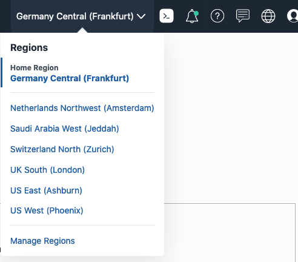
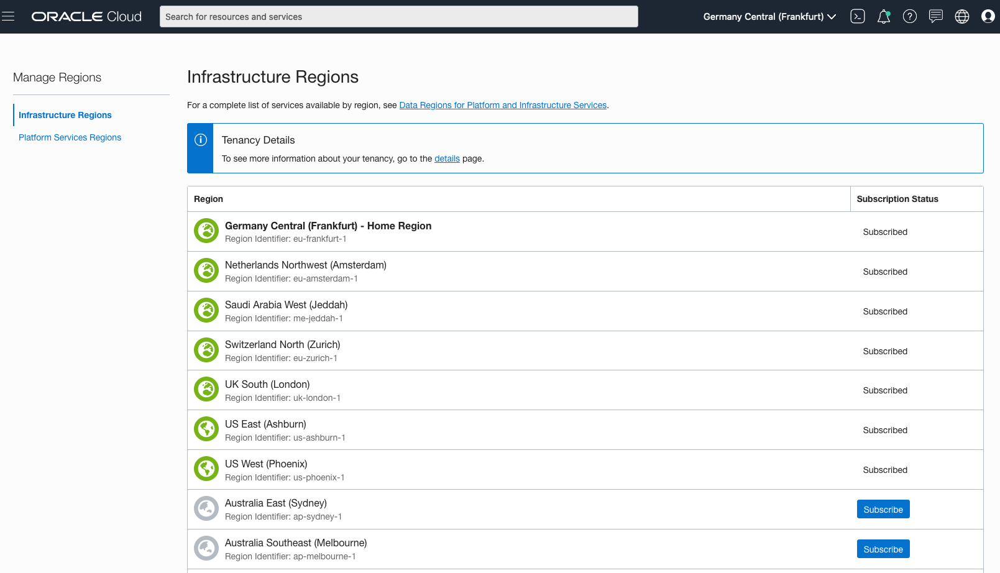
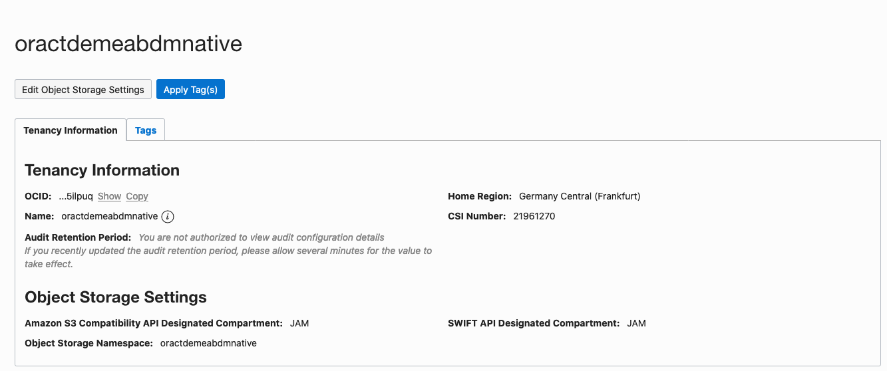
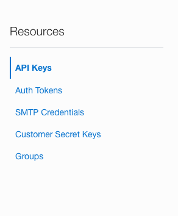
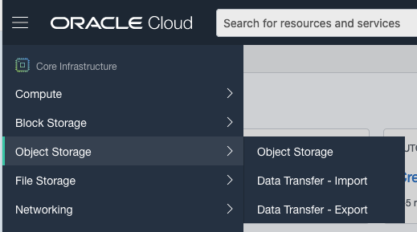
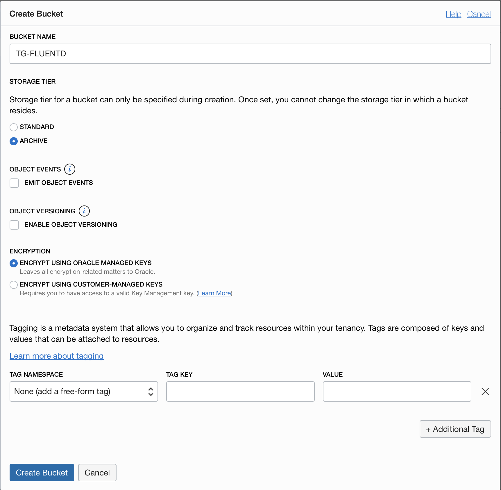

[Go to Overview Page](../Kubernetes-labs.md)


# Migration of Monolith to Cloud Native

## C. Deploying to Kubernetes
## 2. Log Capture for archive


<details><summary><b>Self guided student - video introduction</b></summary>
<p>

This video is an introduction to the Log Capture for archive labs Once you've watched it please press the "Back" button on your browser to return to the labs.

[](https://youtu.be/lqsq1RtsV28 "Kubernetes log capture for archive video")

</p>
</details>

---

### Introduction

We've seen one way to capture log data so it can be processed, but sometimes you just want to save it in the longer term, possibly for legal reasons. While the initial part of the process is similar the approach needed for long term retrieval of data is usually very different from that needed for the analysis of the data. This is especially true if the chance is high that the data will not ever be used ("Write Only Data") where you need to meet the obligations to store it, but are focused on the costs or saving and storing, and the cost of a very occasional retrieval is less important. For example it may be considered very reasonable to not index log data that is in being held for long term storage, but only group it in large chunks, say one chunk per day) understanding that if data is needed that the entire days data may need to be processed, but accepting the cost of doing that as it's less than the overhead of creating and maintaining an index with a higher resolution.

We're going to now look at how to extract data and save it to a storage service. This section is based on [this blog entry created by Ankit Bansal](http://www.ankitbansal.net/centralized-logging-in-oracle-kubernetes-engine-with-object-storage/#) but modified to fit in with the specific environment of the lab.

Note, if you still have the fluentd configuration setup monitoring to Elastic Search you can leave that running if you like. It is of course consuming resources, but there are situations where you may want long term storage of log data as well as short term analytics. 

### Storing the log data

We will be using one of them built in output plug-ins of Fluentd that allows us to write to storage solutions that provide a Amazon S3 compatible interface. In this case we will be writing the data to the Oracle Storage Service, but you could of course use other compatible services.

The first thing we need to do is to gather a bit of data about the storage service to configure the fluentd output plugin.

We need to provide five pieces of information, The region ID and the storage service endpoint URL. The keys (Secret and public) that as a pair give access to the storage API and the name of the storage bucket to hold the saved data.

We also need to specify what OCI COmpartment the data will be stored in - the AWS S3 does not have the concept of compartments, so we need to specify the one that will be used.

We we gather this information but **please save it** in a text editor or notepad for later use !

Firstly let's get the OCI Region details.

On the upper right of the OCI browser UI you will see the name of **your** current region


In the example above this is Germany Central (Frankfurt) **but yours may vary**

However we need the region ID, not the name

- Click on the name you will get a list of regions enabled for your tenancy.


- Click the **Manage Regions** button to get a list of the inrastructure regions, along with their details


Regions that are enabled for **your** tenancy are in green, the ones in grey are not enabled.

- Locate **your** region in the list (it will have a green region icon) Then locate the region identifier, these are the details for the region I'm using Frankfurt in Germany.


We can see here that the region identifier for Frankfurt (the region I'm using) is `eu-frankfurt-1` **your region identifier will be different if you are not in this region**

Next we need to get the storage endpoint this is of the form `https://<object storage namespace>.compat.objectstorage.<region identifier>.oraclecloud.com` Obviously we need to determine the value of `<object storage namespace>` (you have just retrieved the region identifier)

In the upper right of the screen you can access your tenancy details.


- Click on the little "shadow" of a person to access your profile.


- Click on the tenancy name (oractdemeabdnmative in this case) to access the tenancy details


In this case in the Object Storage Settings you can see that the `Object Storage Namespace` is `oractdemeabdmnative` It will be different in other tenancies. This particular tenancy is quite old which is why the storage namespace is the same as the tenancy name, recent tenancies have a storage namespace that is a set of random letters and numbers.

The object storage endpoint is `https://<object storage namespace>.compat.objectstorage.<region identifier>.oraclecloud.com` Replace `<object storage namespace>` with the value you've just retrieved and `<region identifier>` with the value you gathered earlier.

For example **FOR MY TENANCY, YOURS WILL VARY** it might be  `https://oractdemeabdmnative.compat.objectstorage.eu-frankfurt-1.oraclecloud.com`

- Save the Object Storage Service endpoint in your texteditor for later use.

- Note the value for the `Amazon S3 Compatibility API Designated Compartment:` (`JAM` in this case)

This is the OCI compartment that will be used to hold the storage bucket. In this case the compartment is names `JAM` If there is no compartment shown then the storage bucket will be created in the root compartment. If you want to change that (only do this if this is your tenancy, if it belongs to your organization then make sure your tenancy admin is OK with you changing it as you might break other things) then click the `Edit Object Storage Settings` and chose another compartment (if this is a new tenancy you may only have one compartment)

We need to have security keys to access the S3 compliant storage API. Access those from the User details. 

- Click on the little "shadow" of a person to access your profile.


- Click on your name (in this case oracleidentitycloudservice/tim.graves) to go to your account details.

Locate the resources section, this is on the lower left of the page (you may need to scroll down to see it



- Click on the `Customer Secret Keys` in the resources section.

The table changes to showing the `Customer Secret Keys` table


In this case there is already one Customer secret key for my account.

Note, if you have already generated a Customer Secret Key for another reason (you may have been doing a different lab) and you still have both the key and the secret, then you can re-use those values. You only need to do this if you do not have the information for a secret key you've previously generated.

To generate a new Customer Secret Key 

- Click the generate secret key button. 


- Provide a name that you'll be able to remember, in this case I'm using `MySecretKey` but you chose your own

- Click the `Generate Secret Key` button, to get the system to generate a key pair for you.


**VITALLY IMPORTANT**

- Click the `Copy` link to copy the secret key, be sure to paste it into a texteditor or somewhere safe (this is a secret key, so it needs to be protected against access.) **You cannot retrieve it at any point once this popup is closed** 

- **ONLY** after you'ce copied and saved the secret key click the `Close` button


You'll see the newly generated key in the list (remember in this case I had an existing key, you may not have in which case you'll only see the key you just generated)

You now need to get the access key (this is the other part of the generated key pair)

- Click on the `Access key` for the key you just generated, if you have multiple keys remember to chose the key you just generated (the name you chose will help you)


Click on the `Copy` link to get a copy of the key, save this in a text editor or something.

You have now gathered the 

### Create the storage bucket

You can let the S3 integration just create the storage bucket, but the scenario we are looking at here is for the long term retention of the log data for occasional access, in that case you want the cheapest possible storage, and for that you need the archive storage tier for the storage bucket, that needs to be set when the Oracle Object Storage Service bucket is created.

Here  we're using the archive tier, but if you were writing the data to storage on a temporary basis (maybe you do a daily batch upload into the Oracle Log Analytics) then there is no point in using the archive tier as you'd be wiping them every day once they were uploaded, so you would use the standard tier.

<details><summary><b>What's the difference between Standard and Archive tiers?</b></summary>
<p>

The `Standard` storage tier is designed for immediate access, the `Archive` tier is designed for infrequent access, may have a time delay (up to an hour) between requesting access and being able to read the data. There is a significant cost difference between the two storage tiers, at the time of writing this document (early May 2020) Archive storage was 1/10th the cost of Standard storage / GB / month.

Though it is an implementation detail it is highly likely that data placed in archive storage is actually held on magnetic tape, not disk, this also means that data that has just been written cannot be immediately retrieved as that tape is almost certainly still in use having other data written to it. This and the time taken to get a free tape drive and load a tape (in a automated tape library of course) are the reasons why it can take a while to make archive data available for retrieval.

In both cases the data is encrypted at rest, and is protected via the use of multiple copies and checksums.

---

</p></details>

Let's create our storage bucket. 

- Log in to the OCI in your web browser

- Click on the "Hamburger" menu, then under Core Infastructure click on `Object Storage` then `Object Storage` 



This will take you to the storage service page


- Make sure in the compartments list you have selected the compartment used for the Amazon S3 Compatibility (this was shown in the tenancy details earlier.) This may be `root` if there isn't a S3 compatibility compartment specified for the tenancy

You will now see a list of buckets in this compartment, In this case there is just one called `TG` In your tenancy there may be a zero or more existing buckets.


We're going to create a new bucket set for archive storage

- Click the `Create Bucket` button.

- In the popup name the bucket **<your initials>**-FLUENTD For fluentd to write to this bucket the name **must** be entirely in UPPER CASE and you **must** replace <your initials> with something unique to you !

- Change the storage tier option to **archive**


- Click the `Create Bucket` button

Note, if the bucket name must be unique in your tenancy, if it's not (even if the other bucket is in a different compartment) you will not be able to create it and will have to try again using a different name.

You will now see the list of buckets in your compartment. Remember that in my case the `TG` bucket existed previously.


Note that the storage tier for the new bucket (named TG-FLUENTD in this case **but yours will vary**) is `Archive` This means all data will be held in a long term storage model which is much cheaper, but may take time to become available when requested.

### Setting up the log monitoring.

- Change to the `$HOME/helidon-kubernetes/managmenent/logging` folder.

There are a several of yaml files that we will use. These will all be applied in the `logging` namespace

The `fluentd-to-ooss-configmap.yaml` file defines a configuration map representing the basic configuration for fluentd, in this case it tells it to use the S3 compatible output for all log data. This is mounted into the pod as the the `fluentd.conf` file. This config map brings in some of the environment variables that are defined in the `fluentd-s3-configmap` and processed when the `fluentd-daemonset-oss-rbac.yaml` is applied and the logs start. Kubernetes uses the syntax `"#{ENV['SWITCH_LOG_FILE_INTERVAL']}"` to identify that the environment variable needs to be substituted.

The `fluentd-s3-configmap.yaml` contains a config map with the specific settings we will be using (these are what you gathered above) which are applied to the environment variables inside the pod. You will need to edit this to hold the values you gathered.

The `fluentd-daemonset-oss-rbac.yaml` configured the cluster role, service account, binding between the two and also the details of the daemonset that gathers the log data and writes it to the S3 compatible storage service. The daemon set uses the values that are set in the `fluentd-s3-configmap.yaml` for it's environment variables (look at the file for the details of how the environment variables are defined in terms of config map entries.) This means we won't need to change the daemon set configuration / it's yaml file if we want to change those settings.

<details><summary><b>How does Kubernetes know where to get the environment variable values ?</b></summary>
<p>

The container template in the daemon set description has a section that allows the definition of environment variables. These can come from many different sources, including constant values, config maps and secrets.

As an example of the YAML uses that does this see the following small segment of this file

```yaml
    containers:
      - name: fluentd-to-ooss
        image: fluent/fluentd-kubernetes-daemonset:v1-debian-s3
        env:
          # Bring the values you're likely to need to customise in from the config map, thus limiting the number of places we are likely to need to make changes.   
          - name: SWITCH_LOG_FILE_INTERVAL
            valueFrom:
              configMapKeyRef:
                name: fluentd-s3-config
                key: SWITCH_LOG_FILE_INTERVAL
```

in the `env:` section we see the name of the environment variable (`SWITCH_LOG_FILE_INTERVAL` in this case) that it comes from the key `SWITCH_LOG_FILE_INTERVAL` which is in the config map called `fluentd-s3-config`

---
</p></details>
You will need to edit the `fluentd-s3-configmap.yaml` file and update it with the values you gathered earlier. Remember to keep the values in double quotes.

ACCESS_KEY - This is the OCI access key
ACCESS_SECRET - This is the OCI secret key
REGION - The OCI Region
STORAGE_END_POINT - The object storage endpoint
BUCKET_NAME - The name of the bucket you created

Do not change the ROTATION_INTERVAL setting, leave that set to 60

The following is an **example** of the updated file. This specific example **will not work** in your tenancy, you will need to use the values you gathered for your tenancy.

```yaml
apiVersion: v1
kind: ConfigMap
metadata:
  name: fluentd-s3-config
  namespace: logging
data:
  ACCESS_KEY: "225c7ab16d07465e2503714e724863ea552e11b0"
  ACCESS_SECRET: "bgUdGT20T4KpFh5bkJR0pYBwxR4xsiz2utj3f+W2mJ8="
  BUCKET_NAME: "TG-FLUENTD"
  REGION: "eu-frankfurt-1"
  STORAGE_END_POINT: "https://oractdemeabdmnative.compat.objectstorage.eu-frankfurt-1.oraclecloud.com"
  SWITCH_LOG_FILE_INTERVAL: "60"
```

<details><summary><b>What's the SWITCH_LOG_FILE_INTERVAL for?</b></summary>
<p>
The SWITCH_LOG_FILE_INTERVAL tells fluentd how often to switch to a new output file.

For lab purposes we have setup the configuration with a 60 second cycle on switching log files. This is to enable us to see output in a reasonable time (the files don't show up in the object storage until they have been written and closed, then the archiving process completed. In a normal situation this would be set to a much higher value, say 3600 seconds, so the log files would switch once an hour (so if you use this config file in your environment remember to update the SWITCH_LOG_FILE_INTERVAL value to reflect your needs.)
---
</p></details>

### Actually starting the log capture

First we will create the `fluentd-config-to-ooss` config map, this is in the `fluentd-to-ooss-configmap.yaml` This is the basic configuration of fluentd and tells it to output to the S3 service, it just used environment variable place holders for the actual setting details though, the Kubernetes runtime will replace those with the actual values from the environment when the configuration map is added to the pod as it starts.

- In the OCI Cloud Shell type :
  - `kubectl apply -f fluentd-to-oss-configmap.yaml`

```
configmap/fluentd-config-to-ooss configured
```

Now let's apply the configuration settings specific to our environment. These are the settings used to setup the environment variables inside the the daemonset configuration

- In the OCI Cloud Shell type :
  - `kubectl apply -f fluentd-s3-configmap.yaml`
  
```
configmap/fluentd-s3-config configured
```

Finally let's start the daemonset itself

- In the OCI Cloud Shell type :
  - `kubectl apply -f fluentd-daemonset-oss.yaml`

```
serviceaccount/fluentd-to-ooss created
clusterrole.rbac.authorization.k8s.io/fluentd-to-ooss created
clusterrolebinding.rbac.authorization.k8s.io/fluentd-to-ooss created
daemonset.extensions/fluentd-to-ooss created
```

Let's get the specifics of the pods

- In the OCI Cloud Shell type :
  - `kubectl get pods -n logging`

```
NAME                                    READY   STATUS             RESTARTS   AGE
elasticsearch-client-5597688787-mq8qx   1/1     Running            0          12d
elasticsearch-client-5597688787-vzgk6   1/1     Running            0          12d
elasticsearch-data-0                    1/1     Running            0          12d
elasticsearch-data-1                    1/1     Running            0          12d
elasticsearch-master-0                  1/1     Running            0          12d
elasticsearch-master-1                  1/1     Running            0          12d
elasticsearch-master-2                  1/1     Running            0          12d
fluentd-to-es-6vvp4                     1/1     Running            0          42m
fluentd-to-es-wgzrc                     1/1     Running            0          42m
fluentd-to-es-wlhg7                     0/1     CrashLoopBackOff   1          42m
fluentd-to-ooss-fgx4s                   1/1     Running            0          55s
fluentd-to-ooss-frkrp                   1/1     Running            0          55s
fluentd-to-ooss-w7g94                   1/1     Running            0          55s
```

<details><summary><b>What's with the CrashLoopBackOff STATUS ?</b></summary>
<p>
You may occasionally see a fluentd pod with status CrashLoopBackOff, this is usually due to the pod having problems getting log data, it seems there is a problem in fluentd where it sometimes crashes on reading specific kubernetes log files. Kubernetes of course recognises the failure and restarts the pod for us automatically, and fluentd will recover.
---
</p></details>


Let's look at the logs from one of these pods, in this case I'm going to use `fluentd-to-ooss-fgx4s` but of course the pod name you have will be different.

- In the OCI Cloud Shell type :
  - `kubectl logs -n logging fluentd-to-ooss-fgx4s`

```
2020-05-05 14:53:35 +0000 [info]: parsing config file is succeeded path="/fluentd/etc/override/fluent.conf"
2020-05-05 14:53:35 +0000 [info]: gem 'fluent-plugin-concat' version '2.4.0'
2020-05-05 14:53:35 +0000 [info]: gem 'fluent-plugin-detect-exceptions' version '0.0.13'
...
more gem stuff
...
2020-05-05 14:53:35 +0000 [info]: gem 'fluentd' version '1.10.2'
2020-05-05 14:53:37 +0000 [info]: using configuration file: <ROOT>
  <source>
    @type prometheus
    bind "0.0.0.0"
    port 24231
    metrics_path "/metrics"
  </source>
...
Long list of sources
...
  <match **>
    @type s3
    @id out_s3
    @log_level "info"
    s3_bucket "TG-FLUENTD"
    s3_endpoint "https://oractdemeabdmnative.compat.objectstorage.eu-frankfurt-1.oraclecloud.com"
    s3_region "eu-frankfurt-1"
    s3_object_key_format "%{path}%Y/%m/%d/cluster-log-%{index}.%{file_extension}"
    <inject>
      time_key "time"
      tag_key "tag"
      localtime false
    </inject>
    <buffer>
      @type "file"
      path "/var/log/fluentd-buffers/s3.buffer"
      timekey 60
      timekey_use_utc true
      chunk_limit_size 256m
    </buffer>
  </match>
</ROOT>
2020-05-05 14:53:37 +0000 [info]: starting fluentd-1.10.2 pid=6 ruby="2.6.6"
2020-05-05 14:53:37 +0000 [info]: spawn command to main:  cmdline=["/usr/local/bin/ruby", "-Eascii-8bit:ascii-8bit", "/fluentd/vendor/bundle/ruby/2.6.0/bin/fluentd", "-c", "/fluentd/etc/override/fluent.conf", "-p", "/fluentd/plugins", "--gemfile", "/fluentd/Gemfile", "--under-supervisor"]
2020-05-05 14:53:37 +0000 [info]: adding match in @FLUENT_LOG pattern="fluent.**" type="null"
2020-05-05 14:53:37 +0000 [info]: adding filter pattern="kubernetes.**" type="kubernetes_metadata"
2020-05-05 14:53:38 +0000 [info]: adding match pattern="**" type="s3"
2020-05-05 14:53:38 +0000 [info]: adding source type="prometheus"
2020-05-05 14:53:38 +0000 [info]: adding source type="prometheus_output_monitor"
2020-05-05 14:53:38 +0000 [info]: adding source type="tail"
...
more adding source stuff
...
2020-05-05 14:53:38 +0000 [info]: adding source type="tail"
2020-05-05 14:53:38 +0000 [info]: #0 starting fluentd worker pid=15 ppid=6 worker=0
2020-05-05 14:53:38 +0000 [info]: #0 [in_tail_container_logs] following tail of /var/log/containers/kube-flannel-ds-kbphm_kube-system_install-cni-95d15a83f2fc30c51a4467c7e8314cdd442c62e430d61f31f6dfa9cb72e5836e.log
2020-05-05 14:53:38 +0000 [info]: #0 [in_tail_container_logs] following tail of /var/log/containers/kube-proxy-mx5cq_kube-system_kube-proxy-92ac482f6ee8ab963ec3660877efc007e75f967a46a7a3e6514f0fb961e2fc93.log
2020-05-05 14:53:38 +0000 [info]: #0 [in_tail_container_logs] following tail of /var/log/containers/kube-flannel-ds-kbphm_kube-system_kube-flannel-f2bc3614d3e7079f83a75ace155a42be641243320b5f9ca088ecd6961b739279.log
2020-05-05 14:53:38 +0000 [info]: #0 [in_tail_container_logs] following tail of /var/log/containers/proxymux-client-t5m64_kube-system_proxymux-client-821a69cbc98bccf181260fc184fc5172ef5487812098eafffa1b269a7e3572e0.log
...
Lots more output
...
```

The log data shows is the sources whish fluentd is scanning looking for the log data, The match section is the contents of the config map we specified in `fluentd-to-ooss-configmap.yaml` but nots that there are values for items like `s3-bucket` which reflect the settings we provided in the `fluentd-s3-configmap.yaml` file of our environment specific settings.

### The saved log files

Open the Object storage page on the OCI web console again and navigate to the bucket you created


You can see the list of logs that have been saved. Note that all of them have a status of `Archived`.

Let's start the process to restore from the archive.

Click the selection checkbox next to **one** of the entries. 


Note that the `Restore` and `Delete` buttons are now enabled.

Click the `Restore` button, the confirm restore popup is shown


By default the restored data is available for 24 hours before it's only available in the archive again, you can change this duration if you like, but for now we'll leave the field blank which keeps the default 24 hours download window. The storage service will be charging you the extra copy for the time it's spent online, so you want to keep that to a minimum that meets your needs

Click the `Restore` button and the object storage service will trigger the restore process to start.


You can see that the status is now `Restoring`. Of course there is also a REST API to allow you to automate this process if you wanted in a production environment.

It can take up to an hour for the restore process to complete (remember we chose `Archive` as the storage tier as we wanted to show how to do long term cost effective storage of log data, and the archive tier is far more cost effective compared to the `Standard` tier, but the balance of that is the time to restore if you need to access the data. 

If you want to progress with the lab then you can do so and come back to this section later to look at the restored data.

Once the restore process has completed you will see that the objets state becomes `Restored`


- Click the three vertical dots just to the right of the word Restored to get the object menu.


- Click the `Download` option on this menu

Your web browser will start to download the object and depending on the web browser you will get a download options popup. This is the one I got when doing the download using Firefor on MacOS Catalina


To access the restored object follow whatever the normal procedure is on your computer to access a downloaded `.gz` file.

### Stopping the log capture

If you want to leave the log capture running to see more of the data please feel free to do so, but do remember that this is consuming processing and storage resources. If you don't want to keep those tasks running the simplest way to stop all of the log capture activities is to delete the entire `logging` namespace. 

To delete the `logging` namespace (if you have chosen to do this)
- In the OCI Cloud Shell type :
  - `kubectl delete namespace logging`
  
```
namespace "logging" deleted
```

This may take a short time as there is quite a lot of stuff to be stopped and removed form the Kubernetes cluster.

Note that this will **not** reclaim the Object storage space used as the Object storage service is outside the Kubernetes environment. 

<details><summary><b>If you want to reclaim the Object storage capacity used</b></summary>
<p>

If you want to reclaim the object storage capacity you've used for the log data (and you have looked at the restored data, or do not want to look at it) then follow these instructions.

You should have stopped the log capture first of course !

In the Object bucket details screen 

- Check that you have the right storage bucket, if you have a commercial or production tenancy you will not be popular if you delete someone else's data !

- Click the checkbox next to the `Name` heading at the top of the objects table


- Click the `Delete` button.

Confirm

May need to repeat if there are multiple pages of objects.

Once you have deleted all of the captured log data objects than you can also delete the bucket if you want.
Make sure you are in the bucket and it is empty


- Click on the `Delete` button above the bucket details

You will be presented with a confirmation screen


- Click the `Delete` button to confirm.

Only if the bucket is empty will the delete process complete. If it's not then you will get the following error


Even though it seems you can press `Delete` anyway this won't have any effect (Yes, this seems odd to me as well.) Click on the `Cancel` button and make sure you have selected all the objects and deleted them, then try to delete the bucket again.

Once the bucket has been successfully deleted you will be returned to the list of buckets in the S3 compatibility compartment (`JAM` in my case)


Of course there is also a REST API to allow you to automate this process if you wanted in a production environment.

---
</p></details>

### Summary

We have seen how you can capture log data for long term storage, in this case using fluentd and saving the data to the Oracle Object Storage Service as archived objects. 

Of course if the cost savings of the long term storage are outweighed by the time taken to retrieve the log data (maybe you're only holding it for a few days and it's being used often in that time) then you can use the standard storage tier which os more expensive, but offers immediate access.