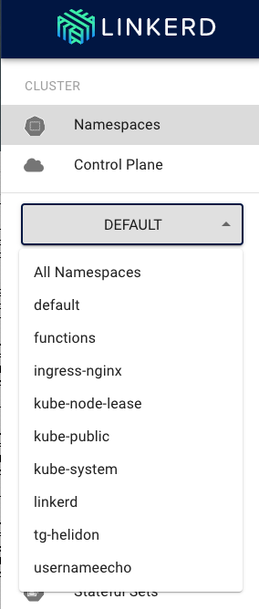
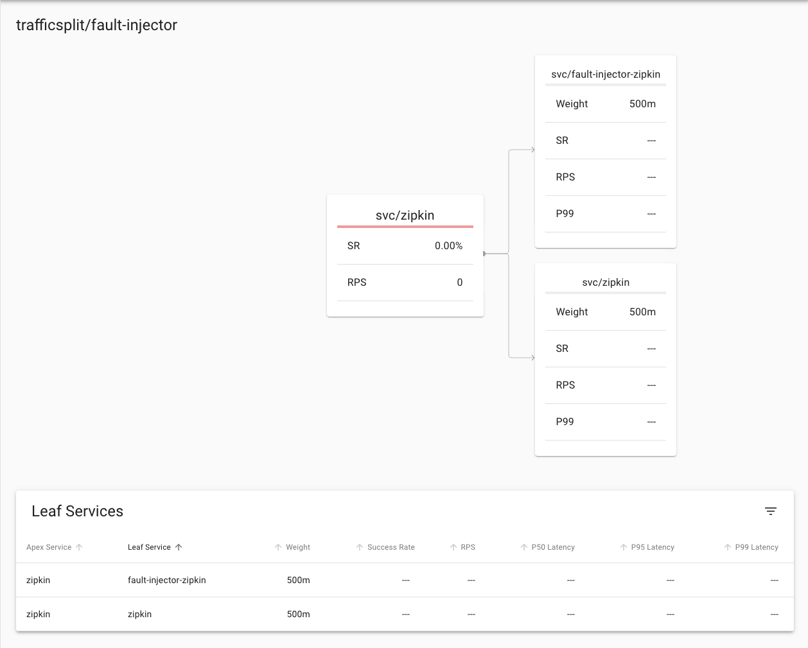
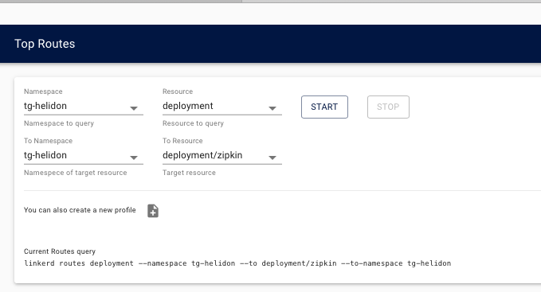

[Go to Overview Page](../Kubernetes-labs.md)


# Migration of Monolith to Cloud Native

## C. Deploying to Kubernetes

## Optional 3d. Exploring traffic splits with a Service mesh.

# IN DEVElOPMENT

# NEED INTRO VIDEO 

<details><summary><b>Self guided student - video introduction</b></summary>
<p>

This video is an introduction to the Service mesh traffic splits lab. Once you've watched it please press the "Back" button on your browser to return to the labs.

[](https://youtu.be/kc1SvmTbvZ8 "Kubernetes core features lab introduction video")

</p>
</details>

---

## What is a a traffic split, and what can I do with it

A traffic split is just what it says, the traffic arriving at a service is split between the implementation instances. In core Kubernetes this is done using the selector in the service to locate pods with matching  labels. Then traffic sent to the service is split between the different pods, often using a round robin approach so each pod responds in turn.

In a service mesh a traffic split can do the traditional Kubernetes round robin approach, but it can do a lot more. For example there could be two different versions of the service, with the service mesh sending a percentage of the traffic to the different versions. This is useful if for example you want to try out one of the versions to see if it produced better business results (called A/B testing) or maybe you want to try out a new version of your micro-service before fully rolling it out. By diverting a small percentage of the traffic to it you can find out in the real deployed environment if it has any faults or returns errors. If it does then the new version is abandoned and the traffic all goes to instances of the old version, but if the new version turns out to be more reliable than the old one then you complete the rollout process and switch entirely to the new version.

Some service mesh implementations even have the ability to examine the headers in the request and make traffic split decisions based on those. An example of this in use would be to test out a new micro-service version in the real live environment, but limiting it's access to only requests with specific headers, thus a test team could deploy the new version, but the service mesh would only route the requests with that specific header to the new version. The rest of the environment would remain the same so the new version is being tested in the real production environment.

You can even use the traffic split to deliberately introduce faults to your environment to see how the system behaves, for example how well the upstream service handles bad result data, or even no response at all. This later function is part of a larger discipline called [Chaos Engineering](https://en.wikipedia.org/wiki/Chaos_engineering) but we will look at a very small part of it here.

Note that in a lot of these cases you use additional external automation tools to manage the service mesh traffic split (and to use it's monitoring) to adjust the traffic split.

This module was written using the information in the [Linkerd fault injection page.](https://linkerd.io/2/tasks/fault-injection/)

## Using a traffic split to test resilience

We're going to use a traffic split to send some messages to a fake zipkin endpoint which will generate errors, this will let us see how well our micro-services handle the situation where zipkin becomes unavailable.

### Setup the fault injection service

Switch to the service mesh directory

- In the OCI Cloud Shell type :
  - `cd $HOME/helidon-kubernetes/service-mesh`

Let's setup the fault injector, this is basically a simple nginx based web server that returns a HTTP 504 error status (Gateway timeout) each time it's accessed.

First setup the config map for nginx, it defines a config rule for nginx that will always return a 504 error

```
apiVersion: v1
kind: ConfigMap
metadata:
  name: fault-injector-configmap
data:
 nginx.conf: |-
    events {}
    http {
        server {
          listen 80;
            location / {
                return 504;
            }
        }
    }
```

- In the OCI Cloud shell type
  - `kubectl apply -f nginx-fault-injector-configmap.yaml`

```
configmap/fault-injector-configmap created
```

Next let's start a service for the nginx instance (feel free to  look at the contents of the yaml, it's a standard service definition, but it maps the incomming port 9411 to port 80 in the deployments)

- In the OCI Cloud shell type
  - `kubectl apply -f fault-injector-service.yaml`

```  
service/fault-injector created
```

Start the nginx fault injector deployment

- In the OCI Cloud shell type
  - `kubectl apply -f nginx-fault-injector-deployment.yaml`

```
deployment.apps/fault-injector created
```

For testing purposes we'll run an ingress, normally you wouldn't need to do this, but I want to show that the service does indeed return 504 errors

- In the OCI Cloud shell type
  - `kubectl apply -f fault-injector-ingress.yaml`

```
ingress.extensions/fault-injector created
```

Test the fault injection returns the right value

- In the OCI Cloud shell type (replace <external IP> with **your** ingress controller IP address)

  - `curl -i  http://<external IP>/fault`

```
Handling connection for 9411
HTTP/1.1 504 Gateway Time-out
Server: nginx/1.19.0
Date: Wed, 03 Jun 2020 13:22:02 GMT
Content-Type: text/html
Content-Length: 167
Connection: keep-alive

<html>
<head><title>504 Gateway Time-out</title></head>
<body>
<center><h1>504 Gateway Time-out</h1></center>
<hr><center>nginx/1.19.0</center>
</body>
</html>
```

<details><summary><b>If you need to remind yourself of the ingress controller external IP address</b></summary>
<p>

- In the OCI Cloud Shell type :
  - `kubectl get services -n ingress-nginx`

```
NAME                                          TYPE           CLUSTER-IP     EXTERNAL-IP      PORT(S)                      AGE
ingress-nginx-nginx-ingress-controller        LoadBalancer   10.96.196.6    130.61.195.102   80:31969/TCP,443:31302/TCP   3h
ingress-nginx-nginx-ingress-default-backend   ClusterIP      10.96.17.121   <none>           80/TCP                       3h
```

look at the `ingress-nginx-nginx-ingress-controller` row, IP address inthe `EXTERNAL-IP` column is the one you want, in this case that's `130.61.195.102` **but yours will vary**

---
</p></details>

OK, the 504 / Gateway Time-out response is generated as we expect.

### Deploy the traffic split

So far all we've done is to create a service that generates 504 errors, we need to look at the traffic split to redirect some of the traffic for the original service to this new one.

Let's look at the traffic split

```
apiVersion: split.smi-spec.io/v1alpha1
kind: TrafficSplit
metadata:
  name: fault-injector
spec:
  service: zipkin
  backends:
  - service: zipkin
    weight: 500m
  - service: fault-injector-zipkin
    weight: 500m
```

Looking at the spec the split is deployed on the service `zipkin` (This is known as the `Apex Service` as it's the actual top level service) The traffic split talks to two backend services (also known as `Leaf services`) the real `zipkin` service and also the `fault-injector-zipkin` service. The weight indicates how many thousandths of the service should go to each backend, so in this example we have a 50/50 split between fault and working, normally you would have a lower number of requests being sent to the fault-injector (after all, if it does break things you don;t want your end customers to be impacted, especially in a production environment if you wern't sure what would happen, but here we want to be confident we'll see some "failures"  generated.

OK, now we know what it is let's deploy it, note that the traffic split is what's known as a custom resource definition, basically is a mechanism to extend the core Kuberntes capabilities.

- In the OCI Cloud shell type 
  - `kubectl apply -f  fault-injector-traffic-split.yaml`

```
trafficsplit.split.smi-spec.io/fault-injector-split created
```

Let's look at the traffic split in the linkerd UI

- In your web browser go to `https://<external IP address>`

If needed accept that it's a self signed certificate and login as `admin` with password you set when installing linkerd


- On the upper left click the namespaces dropdown (It may display `DEFAULT` or another namespace name



- Click **your namespace** in the list (tg-helidon in my case, but yours should be different)

- On the left menu in the configuration section click `Traffic Splits`


You will be shown the traffic splits page


This Shows the traffic split details

Click on the name of the traffic-split `fault-injector`



We can see the details of the traffic split, the `Apex Service` indicates the service the traffic split is operating on, the `Leaf service` shows where the traffic will be split to and the `Weight` indicates the probability of that split option, in this case it's 500/1000 in each case. Of course you could potentially have additional splits.

keep this page open

Let's generate some requests to see what happens

curl -i -k  -u jack:password https://<external ip>/store/stocklevel
^[[AHTTP/2 200 
server: nginx/1.17.8
date: Wed, 03 Jun 2020 18:38:20 GMT
content-type: application/json
content-length: 149
strict-transport-security: max-age=15724800; includeSubDomains

[{"itemCount":410,"itemName":"Pencil"},{"itemCount":50,"itemName":"Eraser"},{"itemCount":4490,"itemName":"Pins"},{"itemCount":100,"itemName":"Book"}]

Well the good news is that on this occasion we got a result, make a few more requests, then return to your web browser (hopefully you left it on the details page of the fault-injection traffic split)

Below is what **I** saw, and it seems that **in this case** the random number generator means that the few requests I made to the traffic split that was connected to the origional zipkin service had all been passed to fault-injector-zipkin which of course failed them all.


**Yours may be different** You may see a partial split where some succeeded and some failed (so some going to the `zipkin` and some going to `fault-injector-zipkin`), of you may see them all succeeding (I.e. all going to the `zipkin` service) as the traffic split works randomly it's impossible to predict exactly

In this case you can see that requests to the fault-injection traffic split had a 0% success rate, and were passed to the failt-injector-zipkin service which had a 0% success rate.

So I can show you what it looks like if there are only some failures I made a few more curl requests and came back to the page


**Again yours will almost certainly be different**

Here we see that 66.67% of the requests to the traffic split had failed (the bar at the top of the service also indicates the failure rate) and that 100% of the requests to zipkin had succeeded, while 100% of the requests to the fault-injector-zipkin service had failed. In this case given the fault-injector-zipkin service will always fail this is what we would expect, but as you'll see later when we look at canary deployments it's not a pure 100% success or failure in all cases.

Of course this is useful, but in this case all it's telling us is that the `zipkin` service always works and the `fault-injector-zipkin` service always fails. What does that mean for the requests to the zipkin service.

- Click on `Routes` on the left menu

- In the `Namespace` dropdown chose the name of **your** namespace (tg-helidon in the example below)

- In the `Resource` dropdown chose `deployment`

- in the `To Namespace` dropdown chose the name of **your** namespace (tg-helidon in the example below)

- In the `To resource` dropdown chose `deployment/zipkin`



This will generate reports from any deployment to the `zipkin` deployment (it is of course possible to look at specific deployments, but this shows us a good overview)

- Click the `Start` button

- Make multiple curl requests 
curl -i -k  -u jack:password https://<external ip>/store/stocklevel


(you may have to scroll down a bit to see the deployment details)

We can see that **in this case** 50% of the requests from the storefront deployment to the zipkin deployment have failed, the same is true for the stockmanager. We know that our traffic split is doing what we expected and that we are failing the requests and potentially causing chaos ! (If you feel like it please feel free to do a Dr Evil or Bond villan manic laugh at this point)

This is great, but how is our service handling it ?

Unless something very unexpected from the point of view of the lab writer has happened all the time you have been getting a reply to the curl command of something like 

```
[{"itemCount":410,"itemName":"Pencil"},{"itemCount":50,"itemName":"Eraser"},{"itemCount":4490,"itemName":"Pins"},{"itemCount":100,"itemName":"Book"}]
```

And you have not had any HTTP errors, this is a pretty good indicator that our service is continuing to work, out little experiment in chaos engineering has given us useful information !

<details><summary><b>What's happening in the pod itself ?</b></summary>
<p>

Wile the service itself is still delivering results fine it's possible that there are useful bit's of information in the logs that might help improve reliability.

First we need the pod name

- In the OCI Cloud shell type 

 - `kubectl get pods`

```
NAME                             READY   STATUS    RESTARTS   AGE
fault-injector-b5bf94d48-f7wbq   2/2     Running   0          55m
stockmanager-7945b54576-9f7q7    2/2     Running   0          69m
storefront-7667fc5fdc-5zwbr      2/2     Running   0          69m
zipkin-7db7558998-c5b5j          2/2     Running   0          69m
```

Now we want to get the logs of the pod itself, in **my** case that's `stockmanager-7945b54576-9f7q7`, but of course yours will be different.

Let's use kubectl to get the logs. Note that as the pod now contains multiple containers due to linkerd injecting them automatically we need to specify the container we want the logs for, as it's names in the deployment. In this case that's the stockmanager container.


- In the OCI Cloud Shell type the following, replace the pod name with your stockmanager pod name :

  - `kubectl logs stockmanager-7945b54576-9f7q7 stockmanager`

```
... Loads of stuff ....
2020.06.03 18:10:01 INFO com.oracle.labs.helidon.stockmanager.resources.StockResource Thread[helidon-4,5,server]: Getting all stock items
Hibernate: 
    SELECT
        departmentName,
        itemName,
        itemCount 
    FROM
        StockLevel 
    WHERE
        departmentName='Tims Shop'
2020.06.03 18:10:02 INFO com.oracle.labs.helidon.stockmanager.resources.StockResource Thread[helidon-4,5,server]: Returning 4 stock items
2020.06.03 18:10:02 WARNING zipkin2.reporter.AsyncReporter$BoundedAsyncReporter Thread[AsyncReporter{URLConnectionSender{http://zipkin:9411/api/v2/spans}},5,main]: Spans were dropped due to exceptions. All subsequent errors will be logged at FINE level.
2020.06.03 18:10:02 WARNING zipkin2.reporter.AsyncReporter$BoundedAsyncReporter Thread[AsyncReporter{URLConnectionSender{http://zipkin:9411/api/v2/spans}},5,main]: Dropped 8 spans due to IOException(Server returned HTTP response code: 504 for URL: http://zipkin:9411/api/v2/spans)
java.io.IOException: Server returned HTTP response code: 504 for URL: http://zipkin:9411/api/v2/spans
        at java.base/sun.net.www.protocol.http.HttpURLConnection.getInputStream0(HttpURLConnection.java:1919)
        at java.base/sun.net.www.protocol.http.HttpURLConnection.getInputStream(HttpURLConnection.java:1515)
        at zipkin2.reporter.urlconnection.URLConnectionSender.skipAllContent(URLConnectionSender.java:232)
        at zipkin2.reporter.urlconnection.URLConnectionSender.send(URLConnectionSender.java:227)
        at zipkin2.reporter.urlconnection.URLConnectionSender$HttpPostCall.doExecute(URLConnectionSender.java:266)
        at zipkin2.reporter.urlconnection.URLConnectionSender$HttpPostCall.doExecute(URLConnectionSender.java:258)
        at zipkin2.Call$Base.execute(Call.java:380)
        at zipkin2.reporter.AsyncReporter$BoundedAsyncReporter.flush(AsyncReporter.java:285)
        at zipkin2.reporter.AsyncReporter$Flusher.run(AsyncReporter.java:354)
        at java.base/java.lang.Thread.run(Thread.java:834)

Hibernate: 
    SELECT
        departmentName,
        itemName,
        itemCount 
    FROM
        StockLevel 
    WHERE
        departmentName='Tims Shop'
... Loads of stuff ....

```

In this case we can find (within a lot of other stuff) the error log details when the stockmanager tried to talk to the zipkin service. We can see that zipkin is dropping the spans.

**If you cannot find this** do not worry, there is a **lot** of log data.

---

</p></details>


For now let's remove the Traffic split and the fault-injector components we created.

- In the OCI Cloud shell type
  - `bash stop-fault-injection.sh`

```
trafficsplit.split.smi-spec.io "fault-injector" deleted
ingress.extensions "fault-injector" deleted
service "fault-injector" deleted
deployment.apps "fault-injector" deleted
configmap "fault-injector-configmap" deleted
```

## Now let's look at how we can use the service mesh to do a canary deployment

### What is a canary deployment ?

---

You have reached the end of this lab module !!

In the next module we will look at how you can use linkerd and grafana to see the traffic flows in your cluster.

Acknowledgements. I'd like to thank Charles Pretzer of Bouyant, Inc for reviewing and sanity checking parts of this document.

Use your **back** button to return to the lab sequence document to access further service mesh modules.