These are the raw stack files that you have to upload to your Resource Manager in order to create the server to run the labs for the wls wdt/tooling session, you should download them before to start the labs to your local folder

Log into your tenancy 

Scroll to Resource Manager / Stack entry

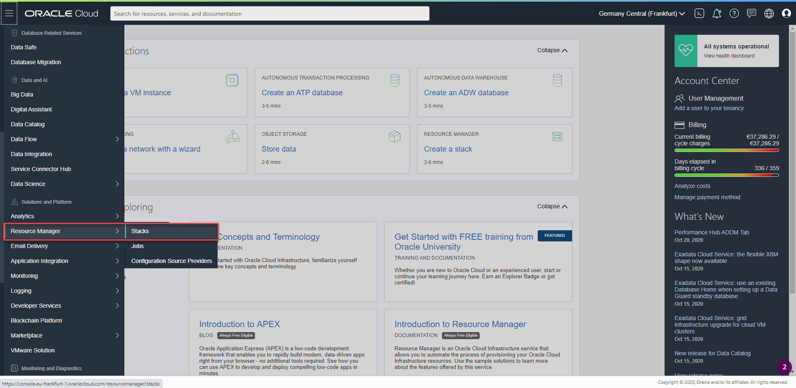

Then choose your compartment:

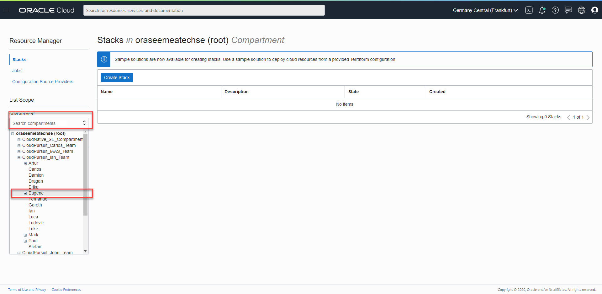

The Click on the Create Stack button:

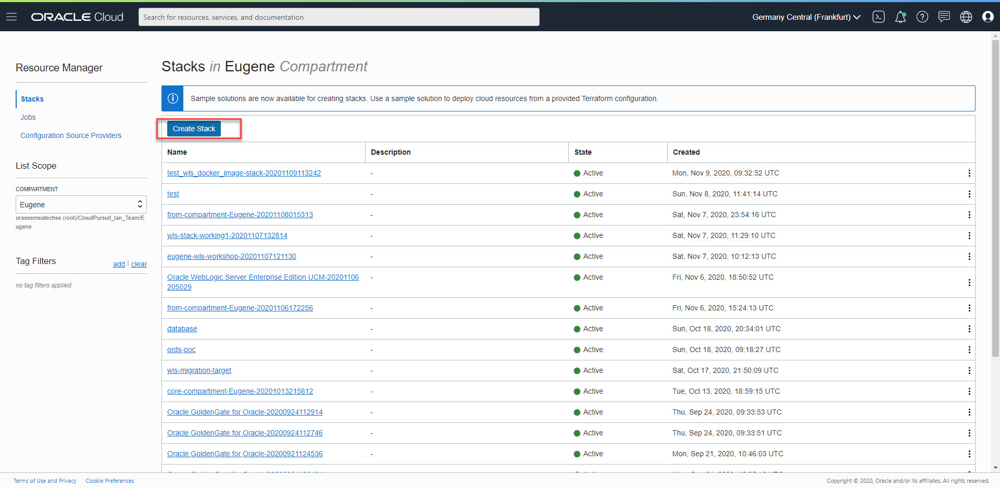

Then Choose folder, and Browse to your local directory :

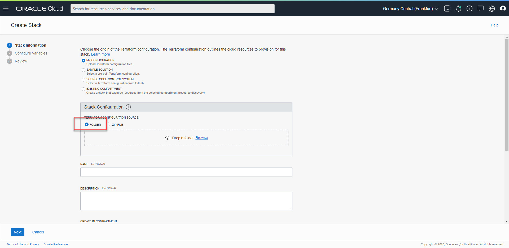

Choose the folder name as origin and click to upload button:

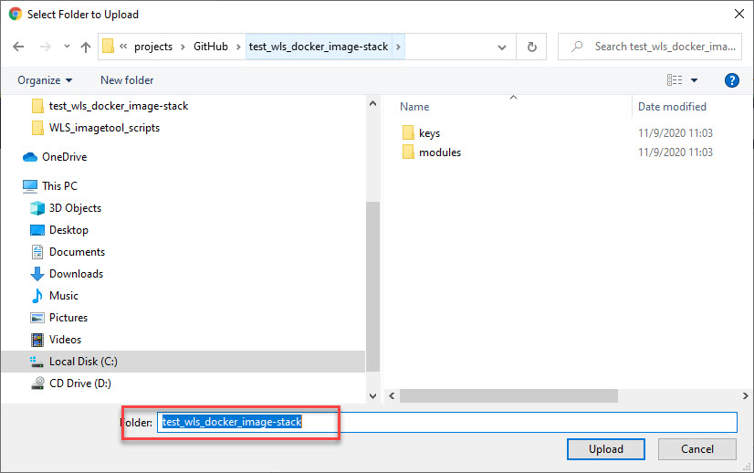

Then accept the option of the uploading :

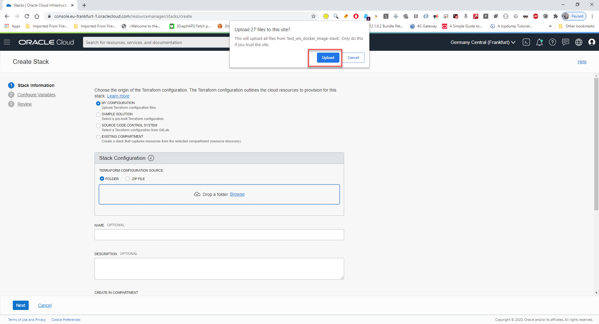

Then check that the stack will be created in your compartment, you can change the name, and you see that a number of files will be used for the creation of your server infrastructure:

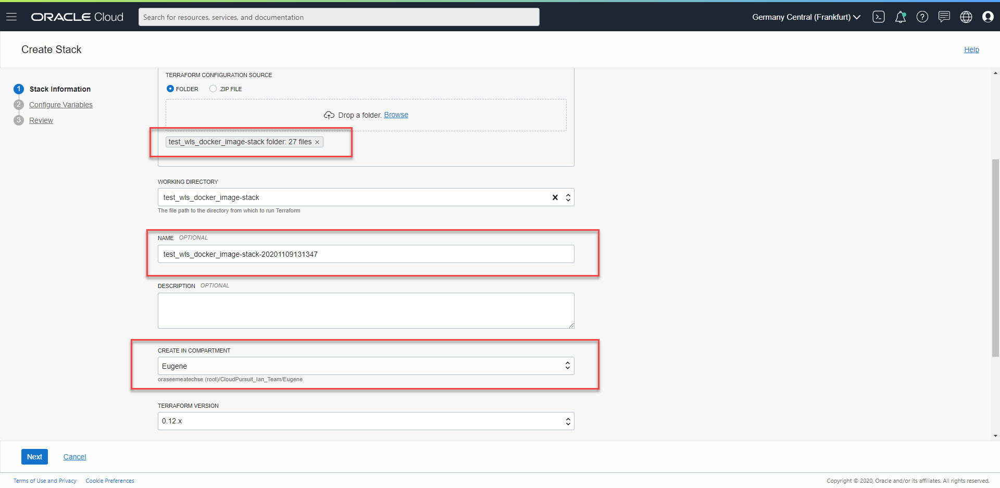

Then copy your OWN PUBLIC KEY in the field SSH_PUBLIC_KEY, and , give also the REGION where your server will be created :

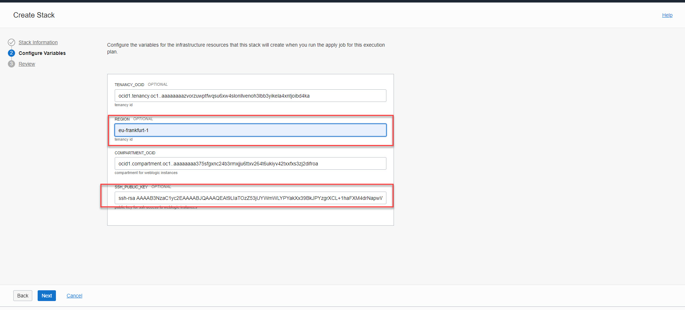

Click Next and review carefully the stack variables , you can still go back if you need to modify them, otherwise click on Create to start the stack creation:

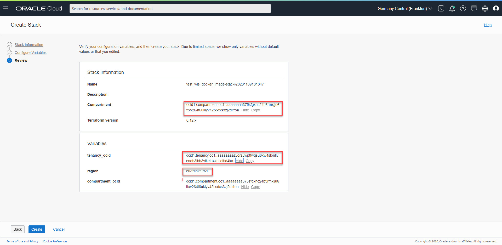

When the stack is created then you will see this screen :

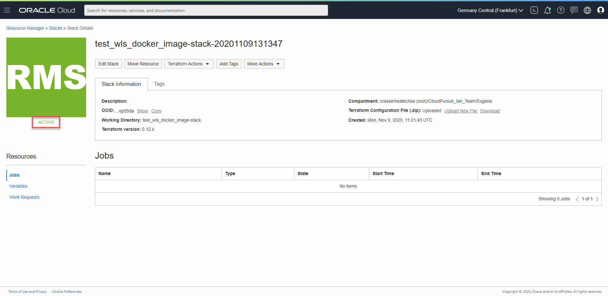

The stack will create a VCN, and a compute node using the below variables :

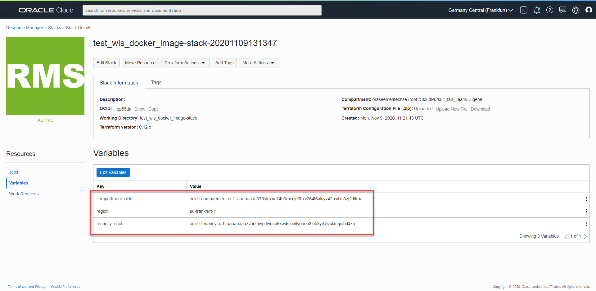

Click on Terraform Apply to launch the stack creation:

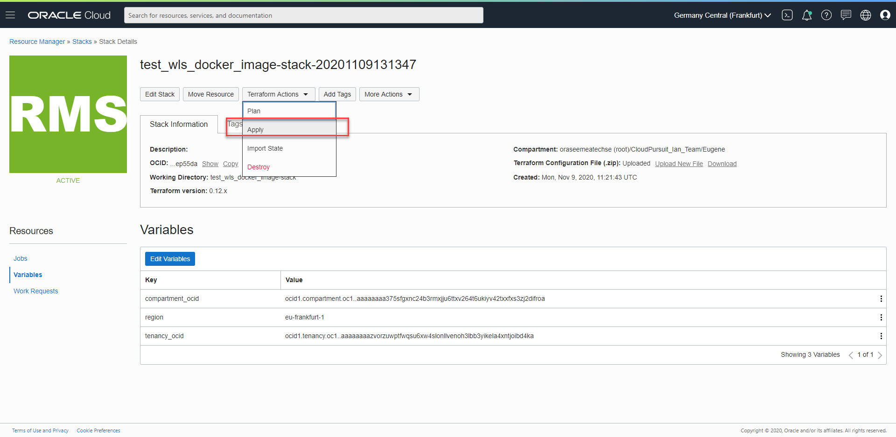

Click on the Apply button to start the process:

After a couple of minutes you will see the progress of the stack creation:

When the status is succeeded then copy the public ip of you server :

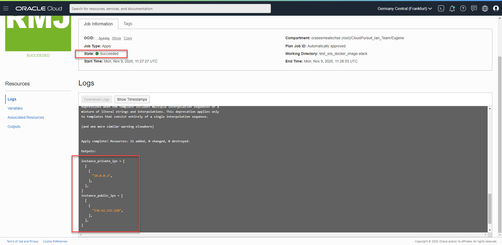

Go to the compute/instances of your compartment and check that the server is up :

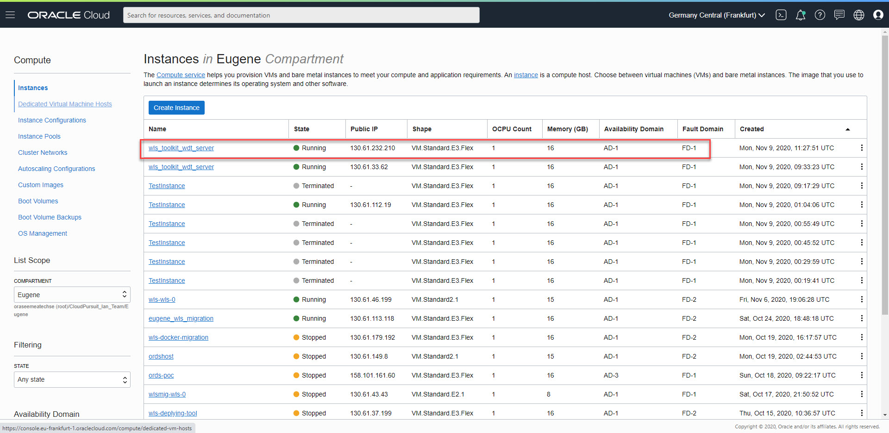

Go to the NetWorking/Virtual CloudNetworks of your compartment

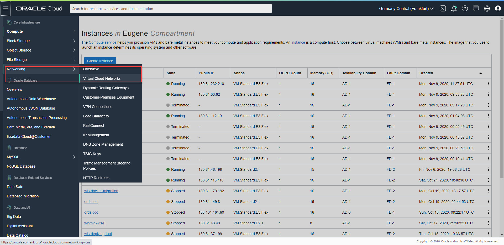

Check that a VCN and the associated resources are created :

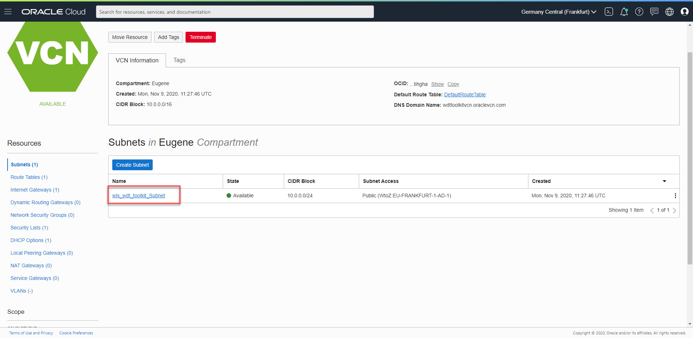

Check the public ip of your server:

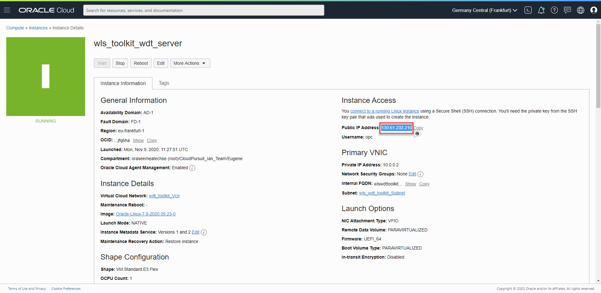

then connect to your server as oracle with your public key  :

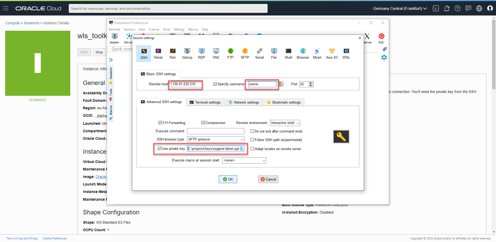

In the terminal enter : docker version

Then enter:

 java -version to check that the java runtime is installed

imagetool to check that the image tool is installed 

the cd stage/installers to check that several files are installed 

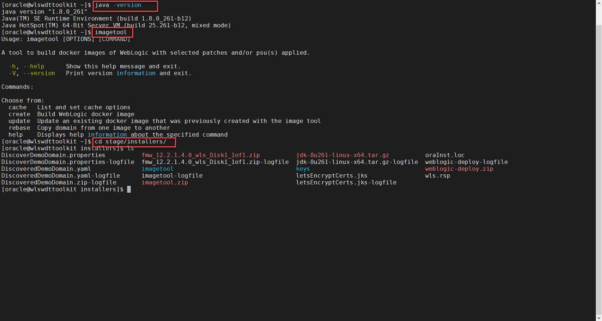

if you see all these artifacts then you server is ready for your labs