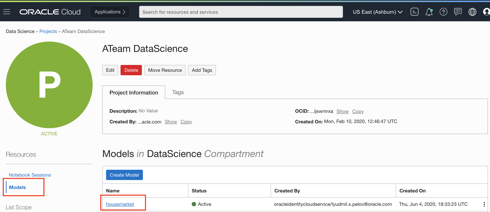
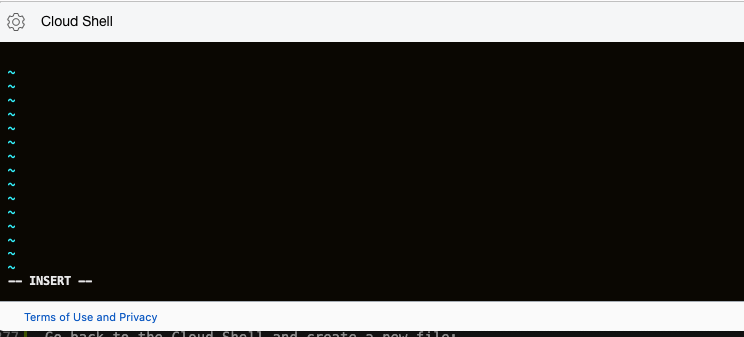
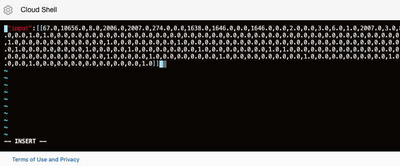
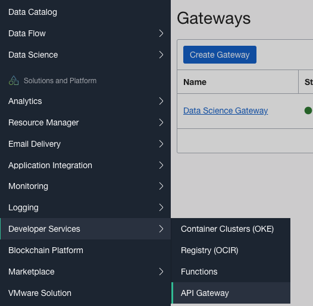
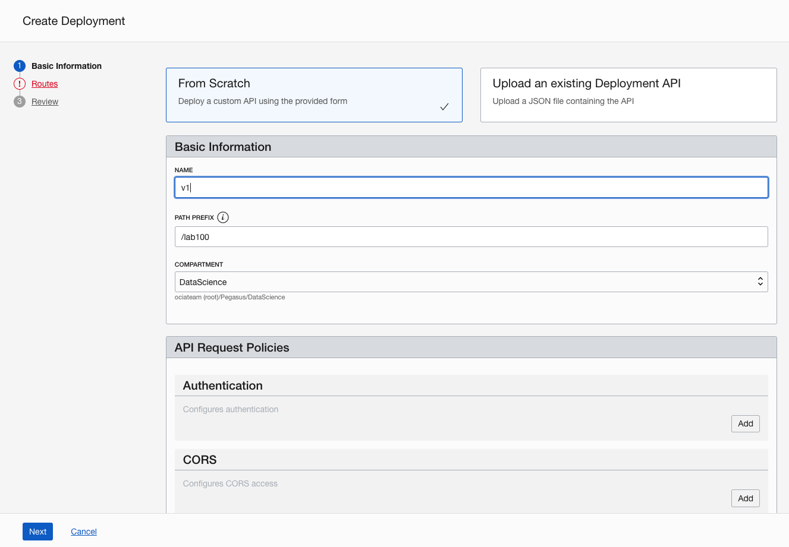
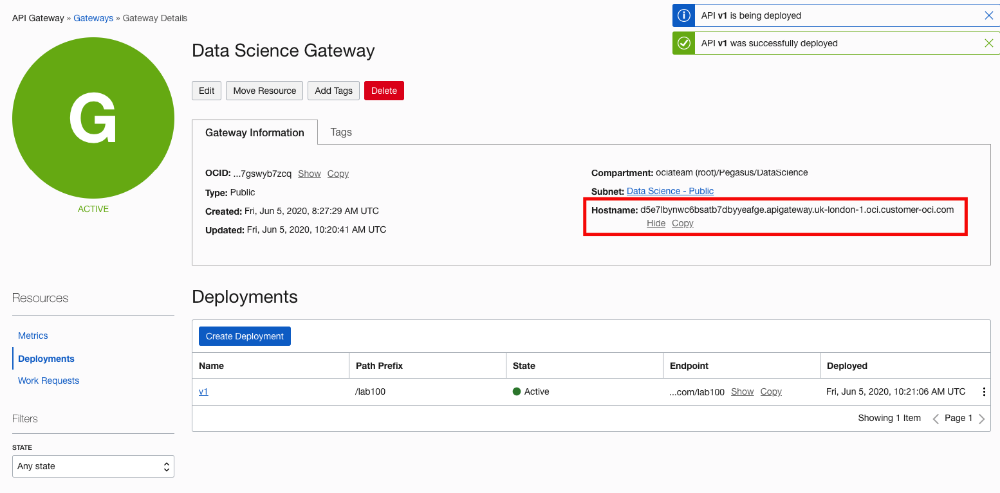

# LAB 100-10: Deploy Module using the Model Catalog


This lab will guide you through the steps required to store a model in Model Catalog from the Oracle Data Science Platform and deploy the model to Oracle Functions, which is one of the current preffered deployment process. Once deployed, we will utilize Oracle API Gateway to define a REST API to access the model.

**This lab is based on LAB100 which you have to finish to be able to proceed.**

In `LAB100` we build a linear regression model. To be able to use the model, we have to store it in a way that it is deployable. One way to do model deployment is using Oracle Functions. Oracle Data Science Service stores the serialized weights of the model as pickle file, which does not require any proprietary software to be read and can be used or deployed to any cloud vendor, compute instance or service you prefer.

**To store the model continue to work in the notebook you used for LAB100.**

## Finish Getting Started Guide

The last step in LAB100 was to used RMSE to validated the performance of the model. Let's now store the model. To do so we need to initialize the ADS (Oracle Accelerated Data Science Library). Before we could use the library you have to make sure that you generated your OCI private key.

**Please follow the steps in the `getting-started.ipynb` file to register your account and generate a key that would allow you to use the ADS library.**

After you finish the registration and validate that the ADS works, we are going to initialize the library now in **the notebook we used for LAB100**.

## Prepare the model artifacts

The first step when saving models to the model catalog is to create a model artifact for each model. We will initiate the ADSModel by using the model we build from the linear regression lab. Notice the **`model`** variable is the model you build as you executed `model = lr.fit(X_train, y_train)`

```python
from ads.common.model import ADSModel
adsModel = ADSModel.from_estimator(model)
```

Now let's load into the model catalog and prepare the model for deployment.

```python
%load_ext autoreload
%autoreload 2
from ads.catalog.model import ModelSummaryList, ModelCatalog
from ads.catalog.project import ProjectSummaryList, ProjectCatalog
from ads.catalog.summary import SummaryList
from ads.common.model_artifact import ModelArtifact

model_artifact_fn = adsModel.prepare("/home/datascience/lab100", force_overwrite=True, 
                                     fn_artifact_files_included=True, fn_name="housemarket")
```

When you prepare the artifact using the `prepare()` method, you can also create the files that are necessary for `Function` deployment by setting the optional parameter ```fn_artifact_files_included=True```. You may also set the function name in `fn_name` parameter. `fn_name` will set the name of your function in `func.yaml`.

Executing `prepare()` now created a new folder called `LAB100` and because we set ```fn_artifact_files_included=True```, within the `LAB100` you can notice that there is additional folder called `fn-model` which contains all the file required to build and deploy the model as function. Your `fn-model` folder should have following structure:

<pre>fn-model/
   + func.py
   + func.yaml
   + model-fn.pkl
   + requirements.txt
   + scorefn.py</pre>

A few remarks on the files in `fn-model/` :

* `model-fn.pkl` under `fn-model` is different from the `model.pkl` file created in the parent folder. `model-fn.pkl` is serialized from core estimator that was used to build the model. For example, if the core model used for creating the model was `sklearn.linear_model.LogisticRegression` then the `type` of `model-fn.pkl` would be `sklearn.linear_model.LogisticRegression`. **This lets you package your model without a runtime dependency on `ADS`.**

* the `requirements.txt` file will contain the libraries required by the core estimator. The version number provided will be the ones that are compatible with the notebook session environment.

* `func.py` and `func.yaml` are templatized and pre-written on your behalf. In principle, you do not need to modify these files unless you want to include additional data transformations steps before passing the data to the estimator object.

## Adjust func.yaml file

Depending on the Data Science Service version if you open the file, you may see a `triggers` configuration, that is no longer needed to deploy the model as function and has to be removed. If you have that option please remove it now from the YAML file. Your `func.yaml` file should look like this:

```yaml
entrypoint: /python/bin/fdk /function/func.py handler
memory: 1024
name: housemarket
runtime: python3.6
schema_version: 20180708
version: 0.0.1
```

## Store the model to the Model Catalog

We initialized already the libraries required to store the model, now execute the following code in your notebook:

```python
import os
compartment_id = os.environ['NB_SESSION_COMPARTMENT_OCID']
project_id = os.environ["PROJECT_OCID"]

mc_model = model_artifact_fn.save(project_id=project_id, compartment_id=compartment_id, display_name="housemarket",
                                 description="test house market model", training_script_path="LAB100.ipynb", ignore_pending_changes=True)
mc_model
```

This code should get the model generated in your LAB100 folder and store it into the Model Catalog. If the process was successful, you should see a confirmation table that has a row with `lifecycle_state` `ACTIVE`.

Go back to your OCI Console in the browser and identify again your Data Science Project. On the left side under `Resources` there is a `Models` link. Click it to see all your stored models:



**Click on the model name `housemarket` to see the model details. `Copy` the model `OCID` and store it, as we would need it later in the lab!**

## Build and deploy using Cloud Shell

To build the function we will use the Oracle OCI Cloud Shell. To open it, click on the Cloud Shell icon on the top right side as shown on the screen-shot below and the `Cloud Shell` should open at the bottom:


Oracle Cloud Infrastructure Cloud (OCI) Shell is a web browser-based terminal accessible from the Oracle Cloud Console. Cloud Shell is free to use (within monthly tenancy limits), and provides access to a Linux shell, with a pre-authenticated Oracle Cloud Infrastructure CLI, a pre-authenticated Ansible installation, and other useful tools for following Oracle Cloud Infrastructure service tutorials and labs, including Functions CLI and Docker. Cloud Shell is a feature available to all OCI users, accessible from the Console. Your Cloud Shell will appear in the Oracle Cloud Console as a persistent frame of the Console, and will stay active as you navigate to different pages of the Console. For more information visit the official documentation under [Cloud Shell Documentation](https://docs.cloud.oracle.com/en-us/iaas/Content/API/Concepts/cloudshellintro.htm)

### Get the model

We will create a folder in the `Cloud Shell` and will download the model into it.

```shell
mkdir model
cd model
```

Download the model from your Data Science Project Model Catalog using the OCI CLI.

```shell
oci data-science model get-artifact-content --model-id <MODEL_OCID> --file model1.0.zip
```

Replace the **MODEL_OCID** with the one you copied from the previous step. The OCI command will download the model and store it into a ZIP file called **model1.0.zip**. `Notice that all the files in the Cloud Shell will be persisted across regions. To download the model however you have to be within the same region where the model was build.`

Unzip the file and go into the `fn-model` folder.

```shell
unzip model1.0.zip
cd fn-model
```

### Set the Fn context

We need to make sure that our current `Fn` context is in the same region.

```shell
fn list context
```

```console
(uk-london-1)$ fn list context
CURRENT NAME            PROVIDER        API URL                                         REGISTRY
        default         oracle-cs
*       uk-london-1     oracle-cs       https://functions.uk-london-1.oraclecloud.com   lhr.ocir.io/ociateam
        us-ashburn-1    oracle-cs       https://functions.us-ashburn-1.oraclecloud.com
```

**Context Change** If the `CURRENT` (shown by the asterix) is not in the same place as the region you currently work on, you can change it with:

```shell
fn use context uk-london-1
```

`Notice` that `uk-london-1` is the region used to build this lab, your region may differ. You can get the region identifier from the following page: [Oracle Regions](https://docs.cloud.oracle.com/en-us/iaas/Content/General/Concepts/regions.htm)

### Update the context

To get access to the Fn apps configured, we have to update the context.

```shell
fn update context oracle.compartment-id <COMPARTMENT_OCID>
```

***Example***

```console
fn update context oracle.compartment-id ocid1.compartment.oc1..aaaaaaaauz6brmxnajpmwvdwupt53uhrb2szkockrbhuruq7pgp3ptl4btdq
Current context updated oracle.compartment-id with ocid1.compartment.oc1..aaaaaaaauz6brmxnajpmwvdwupt53uhrb2szkockrbhuruq7pgp3ptl4btdq
```

`<COMPARTMENT_OCID>` - the OCID of your current compartment, which you can find under `Identity -> Compartments` and select the name of the compartment you are using. `Notice` your compartment could be within another compartment.

### Update the context registry

The registry will be created if not available, it will be the location to store the function.

```shell
fn update context registry <regionid>.ocir.io/<tenancy>/<repo_name>
```

***Example***

```console
fn update context registry lhr.ocir.io/ociateam/lab100
```

`<regionid>.ocir.io/<tenancy>` - you can get this information from the previous command `fn list context` on the right side you will see the default root `REGISTRY` for the current context
`<repo_name>` - name that you can set, you could use `lab100` for example

### List Fn Apps

Make sure that at least one app exist, as the Function will be deployed into it. Make a note of the name to use it later.

```shell
fn list apps
```

***Example***

```console
fn list apps
NAME            ID
DataScienceApp  ocid1.fnapp.oc1.uk-london-1.aaaaaaaaah6lnfurqyoe7x6aqvaarzpdzogmads54qdejr2c4uys5wxtmadq
```

### Build the function

Run the build within the `fn-model` folder. On every build the function version will auto-increment.

```shell
fn build
```

***Example***

```console
fn build
Building image lhr.ocir.io/ociateam/housemarket:0.0.1 .................................................................................
Function lhr.ocir.io/ociateam/housemarket:0.0.1 built successfully.
```

### Deploy the function

```shell
fn deploy --app <name-of-func-application>
```

`<name-of-func-application>` - the name of the function app to deploy into, you can see get the name again using `fn list apps`, in case you don't remember it.

If the deployment process was successful, you should see output similar to this.

```console
fn deploy --app DataScienceApp
Deploying housemarket to app: DataScienceApp
Bumped to version 0.0.3
Building image lhr.ocir.io/ociateam/lab100/housemarket:0.0.3 .......
Parts:  [lhr.ocir.io ociateam lab100 housemarket:0.0.3]
Pushing lhr.ocir.io/ociateam/lab100/housemarket:0.0.3 to docker registry...The push refers to repository [lhr.ocir.io/ociateam/lab100/housemarket]
ab9cd4e4c4bb: Pushed 
84e67d0f38b8: Pushed 
a1447b19f0f0: Pushed 
5c435e8ccbdf: Pushed 
4a9b804f2ebc: Pushed 
580503d21cbd: Pushed 
634699d804a4: Pushed 
d749eea1a4aa: Pushed 
d9947aec7289: Pushed 
83b43189420d: Pushed 
0.0.3: digest: sha256:1357de3ae8f32cdd73a413d4dd2161001d47ffe13e761a807058db3ba6019ccb size: 2417
Updating function housemarket using image lhr.ocir.io/ociateam/lab100/housemarket:0.0.3...
```

### Inspect the Function

Let's check if the function was deployed successfully.

```shell
fn inspect function <name-of-func-application> <name-of-function>
```

***Example***

```console
fn inspect function DataScienceApp housemarket
{
        "annotations": {
                "fnproject.io/fn/invokeEndpoint": "https://uys5wxtmadq.uk-london-1.functions.oci.oraclecloud.com/20181201/functions/ocid1.fnfunc.oc1.uk-london-1.aaaaaaaaadqzhzosm2plcp4ogtsctuor3jzhxe34yftxquqwqlxcl6slxnpq/actions/invoke",
                "oracle.com/oci/compartmentId": "ocid1.compartment.oc1..aaaaaaaauz6brmxnajpmwvdwupt53uhrb2szkockrbhuruq7pgp3ptl4btdq",
                "oracle.com/oci/imageDigest": "sha256:1357de3ae8f32cdd73a413d4dd2161001d47ffe13e761a807058db3ba6019ccb"
        },
        "app_id": "ocid1.fnapp.oc1.uk-london-1.aaaaaaaaah6lnfurqyoe7x6aqvaarzpdzogmads54qdejr2c4uys5wxtmadq",
        "created_at": "2020-06-05T09:42:11.369Z",
        "id": "ocid1.fnfunc.oc1.uk-london-1.aaaaaaaaadqzhzosm2plcp4ogtsctuor3jzhxe34yftxquqwqlxcl6slxnpq",
        "idle_timeout": 30,
        "image": "lhr.ocir.io/ociateam/lab100/housemarket:0.0.3",
        "memory": 1024,
        "name": "housemarket",
        "timeout": 30,
        "updated_at": "2020-06-05T09:43:32.377Z"
}
```

`DataScienceApp` - is the name of the Function app
`housemarket` - is the name of the deployed function

### Create a payload file to test the function

Let's check if the function works properly. To do so invoke it with a payload that represents a single house data. To be able to do that we would need to create a JSON file in the Cloud Shell console and use to invoke the Fn.

**Copy** the entire content below including the brackets:

<p>

{"input":[[67.0,10656.0,8.0,2006.0,2007.0,274.0,0.0,1638.0,1646.0,0.0,1646.0,0.0,2.0,0.0,3.0,6.0,1.0,2007.0,3.0,870.0,192.0,80.0,0.0,0.0,0.0,1.0,0.0,0.0,1.0,0.0,1.0,0.0,1.0,0.0,0.0,0.0,0.0,1.0,0.0,0.0,1.0,0.0,0.0,0.0,0.0,0.0,1.0,1.0,0.0,0.0,0.0,0.0,0.0,0.0,0.0,0.0,0.0,0.0,0.0,0.0,0.0,0.0,0.0,0.0,0.0,0.0,0.0,0.0,0.0,0.0,0.0,0.0,0.0,1.0,0.0,0.0,0.0,1.0,0.0,0.0,0.0,0.0,0.0,0.0,0.0,0.0,1.0,0.0,0.0,0.0,0.0,0.0,1.0,0.0,0.0,0.0,0.0,0.0,0.0,1.0,0.0,0.0,0.0,0.0,0.0,0.0,1.0,0.0,0.0,0.0,0.0,1.0,0.0,0.0,0.0,0.0,0.0,0.0,0.0,0.0,0.0,0.0,0.0,0.0,0.0,0.0,0.0,0.0,0.0,1.0,0.0,0.0,0.0,0.0,0.0,0.0,0.0,0.0,0.0,0.0,0.0,0.0,0.0,0.0,0.0,1.0,0.0,0.0,0.0,0.0,0.0,1.0,0.0,0.0,1.0,0.0,0.0,0.0,0.0,1.0,0.0,0.0,1.0,0.0,0.0,0.0,0.0,1.0,0.0,0.0,0.0,0.0,1.0,1.0,0.0,0.0,0.0,0.0,0.0,0.0,0.0,0.0,1.0,0.0,0.0,0.0,0.0,0.0,1.0,1.0,0.0,0.0,0.0,1.0,0.0,0.0,0.0,0.0,0.0,1.0,0.0,0.0,0.0,0.0,1.0,0.0,0.0,1.0,0.0,0.0,0.0,0.0,0.0,0.0,0.0,1.0,0.0,0.0,1.0,0.0,0.0,0.0,0.0,1.0,0.0,0.0,0.0,0.0,0.0,1.0,0.0,0.0,0.0,0.0,0.0,1.0,0.0,0.0,0.0,0.0,1.0,0.0,0.0,1.0,0.0,0.0,0.0,1.0,0.0,0.0,0.0,0.0,1.0,0.0,1.0,0.0,0.0,0.0,0.0,0.0,0.0,0.0,0.0,0.0,1.0,0.0,0.0,0.0,0.0,0.0,0.0,0.0,1.0]]}

</p>

Go back to the Cloud Shell and create a new file:

```shell
vi hm.json
```

Hit the **`i`** key on your keyboard, you should see that you are now in `INSERT` mode



... and paste the content into that file, it should look like this:



... hit the **`ESC`** key on the keyborad and then type **`:wq`** as shown below to save and exit the file:


Now we can invoke the Function with the payload. **Notice** that the first time function invokation takes a little bit longer.

```shell
cat hm.json | fn invoke DataScienceApp housemarket --content-type application/json
```

***Example***

```console
cat hm.json | fn invoke DataScienceApp housemarket --content-type application/json
{"prediction": [12.423844821926073]}
```

**Notice that the predicted price looks strange and it shows a very small value!** If you remember in LAB100 we scale the Sale Price by using the `np.log` to allow the algorithm to learn better. To get the real price of the house, use the `np.exp` function. Copy the value and go back to your notebook of LAB100 and test it like this:


***The house prices is 248660$***

## Expose the model as REST API with API Gateway

Now that we have the model deployed as a function, we could also use the Oracle API Gateway to expose the model as REST API. Go to `Developer Services->API Gateway`.



Click on the available Gateway and then from the left side `Resources` menu select `Deployments`.

Click on the `Create Deployment` button to start create API Gateway deployment. In the first screen put a name and prefix for the gateway:



... then set context path, method to be `POST` as we need to send data, in our case the single house information, to receive any result. The type is `Oracle Functions`, then select the name of the Fn App and the Function itself.


Review the settings and click on `Create` to confirm. The creation process may take a few seconds to complete.

## Test the REST API

Under the API Gatewat copy the `Hostname` of the service.



With the hostname we could execute the REST API now from outside, for example from our computer:

<p>

curl -X "POST" -H "Content-Type: application/json" -d '{"input":[[67.0,10656.0,8.0,2006.0,2007.0,274.0,0.0,1638.0,1646.0,0.0,1646.0,0.0,2.0,0.0,3.0,6.0,1.0,2007.0,3.0,870.0,192.0,80.0,0.0,0.0,0.0,1.0,0.0,0.0,1.0,0.0,1.0,0.0,1.0,0.0,0.0,0.0,0.0,1.0,0.0,0.0,1.0,0.0,0.0,0.0,0.0,0.0,1.0,1.0,0.0,0.0,0.0,0.0,0.0,0.0,0.0,0.0,0.0,0.0,0.0,0.0,0.0,0.0,0.0,0.0,0.0,0.0,0.0,0.0,0.0,0.0,0.0,0.0,0.0,1.0,0.0,0.0,0.0,1.0,0.0,0.0,0.0,0.0,0.0,0.0,0.0,0.0,1.0,0.0,0.0,0.0,0.0,0.0,1.0,0.0,0.0,0.0,0.0,0.0,0.0,1.0,0.0,0.0,0.0,0.0,0.0,0.0,1.0,0.0,0.0,0.0,0.0,1.0,0.0,0.0,0.0,0.0,0.0,0.0,0.0,0.0,0.0,0.0,0.0,0.0,0.0,0.0,0.0,0.0,0.0,1.0,0.0,0.0,0.0,0.0,0.0,0.0,0.0,0.0,0.0,0.0,0.0,0.0,0.0,0.0,0.0,1.0,0.0,0.0,0.0,0.0,0.0,1.0,0.0,0.0,1.0,0.0,0.0,0.0,0.0,1.0,0.0,0.0,1.0,0.0,0.0,0.0,0.0,1.0,0.0,0.0,0.0,0.0,1.0,1.0,0.0,0.0,0.0,0.0,0.0,0.0,0.0,0.0,1.0,0.0,0.0,0.0,0.0,0.0,1.0,1.0,0.0,0.0,0.0,1.0,0.0,0.0,0.0,0.0,0.0,1.0,0.0,0.0,0.0,0.0,1.0,0.0,0.0,1.0,0.0,0.0,0.0,0.0,0.0,0.0,0.0,1.0,0.0,0.0,1.0,0.0,0.0,0.0,0.0,1.0,0.0,0.0,0.0,0.0,0.0,1.0,0.0,0.0,0.0,0.0,0.0,1.0,0.0,0.0,0.0,0.0,1.0,0.0,0.0,1.0,0.0,0.0,0.0,1.0,0.0,0.0,0.0,0.0,1.0,0.0,1.0,0.0,0.0,0.0,0.0,0.0,0.0,0.0,0.0,0.0,1.0,0.0,0.0,0.0,0.0,0.0,0.0,0.0,1.0]]}' https://hostname/lab100/hm

</p>

**`Notice`** the URL on the end, it is the `<hostname>`/`lab100`/`hm` where the `lab100` and the `hm` are the context paths we setup in the API Gateway configuration. You have to **replace** the `hostname` with the value you copy from the the `Gateway Information` in the previous step. The result should be:

```console
{"prediction": [12.423844821926073]}%
```

As you can see the REST API returns the same sales price value of `12.423844821926073`. If we revert the scale using `np.exp(12.423844821926073)`, we will get the real price.

## Conclusion

There were the steps required to install a model as Functions built with Oracle Data Science Service and stored into the Model Catalog. Notice that most of the configrations have to be done only once. If you have the function app and the API Gateway setup, as well as the current Fn context and registry, you don't need to updated them again for next time deployment, but only download the latest model, build and the deploy directly

## Summary

* You have learned how to store a model build in ODS into the Model Catalog
* You have learned how to use Cloud Shell to download, build and deploy the model as function
* You have learned how to expose the model as REST Endpoint using Oracle API Gatewat

## Follow-up questions


[lyudmil.x.pelov@oracle.com](mailto:lyudmil.x.pelov@oracle.com)


[jeroen.kloosterman@oracle.com](mailto:jeroen.kloosterman@oracle.com)